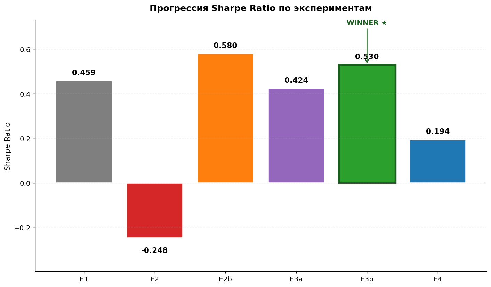
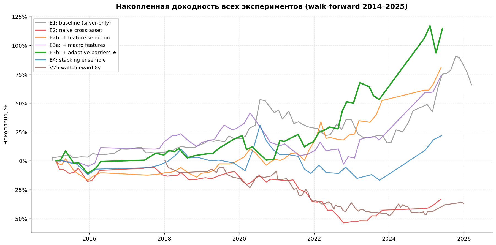
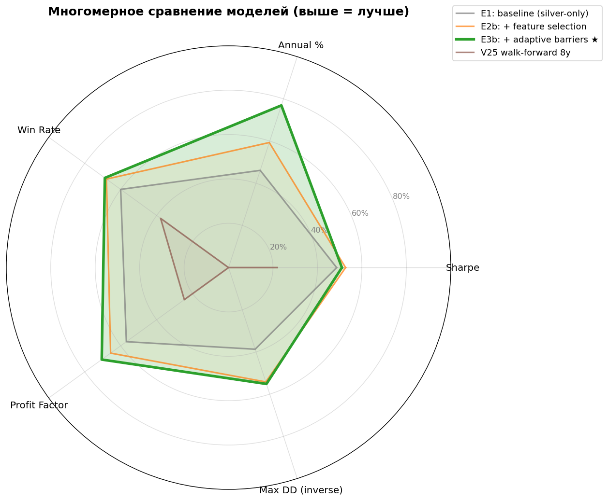
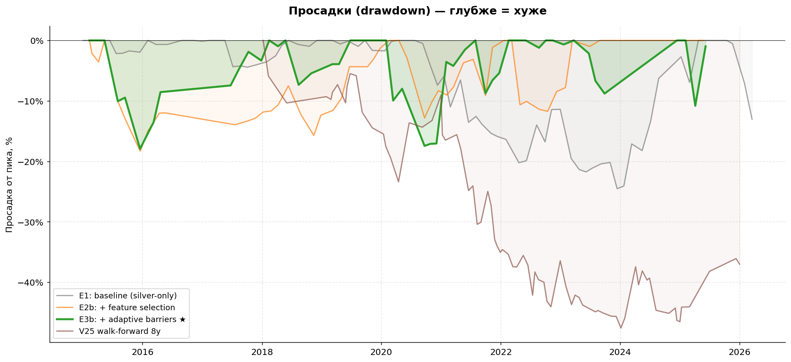
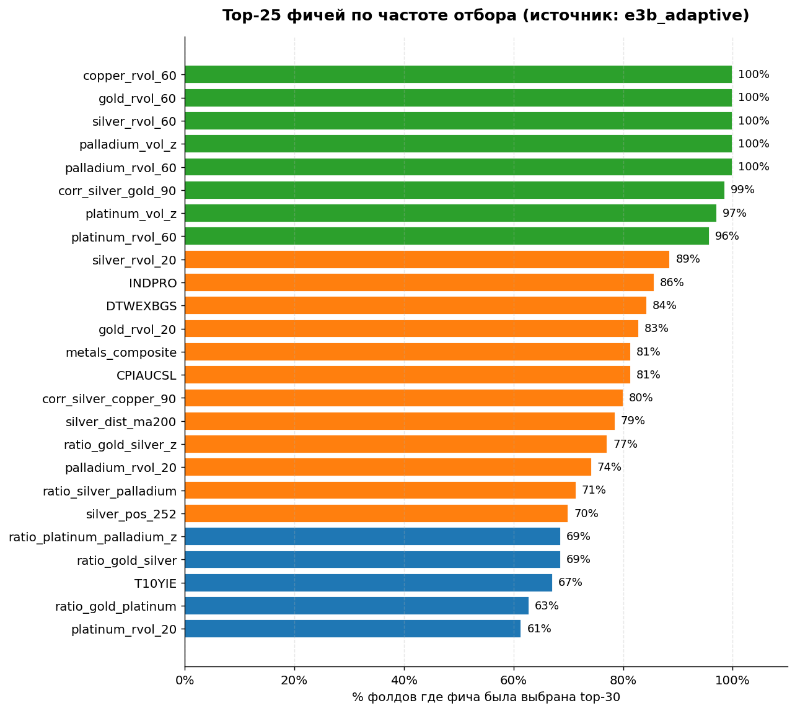
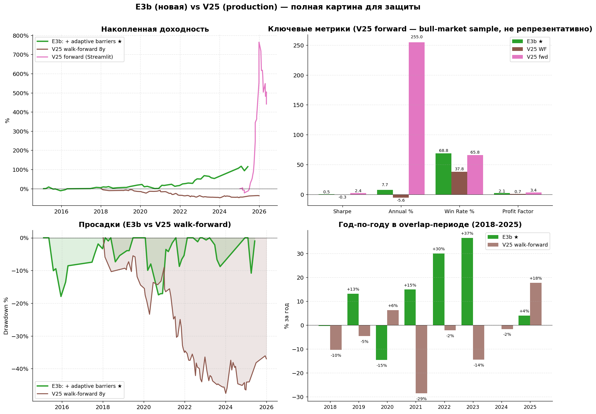

# ВЫПУСКНАЯ КВАЛИФИКАЦИОННАЯ РАБОТА

**Тема:** Разработка интеллектуальной торговой системы для прогнозирования сигналов на рынке фьючерсов на серебро с применением методов машинного обучения

---

## СОДЕРЖАНИЕ

ВВЕДЕНИЕ

1 Теоретические основы алгоритмической торговли и применения машинного обучения на финансовых рынках
1.1 Обзор современных подходов к построению торговых стратегий на основе машинного обучения
1.2 Особенности рынка серебра и временных рядов финансовых данных
1.3 Классические методы валидации торговых стратегий и их ограничения
1.4 Современные методы валидации: walk-forward анализ, CPCV, дефлированный коэффициент Шарпа
1.5 Применение машинного обучения для формирования торговых сигналов

2 Проектирование интеллектуальной торговой системы для рынка фьючерсов на серебро
2.1 Проектирование метода формирования торговых сигналов на основе ML-модели
2.2 Проектирование процесса обучения модели и формирования предсказаний
2.3 Проектирование программной архитектуры системы
2.4 Выбор инструментов и технологий разработки

3 Реализация системы интеллектуального торгового помощника
3.1 Реализация ансамблевой модели машинного обучения
3.2 Реализация пайплайна формирования сигналов и исполнения сделок
3.3 Программная реализация применения метода
3.3.1 Реализация веб-интерфейса пользователя
3.3.2 Реализация системы уведомлений через Telegram-бот
3.3.3 Реализация автоматизированного переобучения и обработка ошибок
3.4 Экспериментальная оценка эффективности на исторических данных

4 Углублённое улучшение модели: cross-asset transfer learning и adaptive barriers
4.1 Постановка задачи и направления улучшения
4.2 Расширение данных через cross-asset подход
4.3 Архитектура экспериментов E1–E4
4.4 Результаты экспериментов
4.5 Финальная модель E3b: характеристики и feature importance
4.6 Сравнение с базовой production-моделью
4.7 Production-интеграция и непрерывное переобучение

ЗАКЛЮЧЕНИЕ

ГЛОССАРИЙ

СПИСОК ИСПОЛЬЗОВАННЫХ ИСТОЧНИКОВ

ПРИЛОЖЕНИЯ

---

## ВВЕДЕНИЕ

В современном мире финансовые рынки становятся всё более сложной и насыщенной информацией средой. Объёмы биржевых данных, поступающих ежедневно с торговых площадок, измеряются терабайтами, а скорость обновления котировок не позволяет частному инвестору самостоятельно учитывать все факторы при принятии решений о покупке или продаже актива. Это особенно заметно на рынке драгоценных металлов и в частности на рынке серебра, где цена формируется под воздействием макроэкономических факторов, динамики промышленного спроса, инфляционных ожиданий и поведения крупных институциональных участников. Серебро традиционно рассматривается как защитный актив, однако его волатильность зачастую превышает волатильность золота, а реакции на новости носят отложенный и нелинейный характер. В подобных условиях ручной анализ рынка с использованием классических методов технического анализа перестаёт давать стабильный результат, что приводит к необходимости разработки автоматизированных систем поддержки принятия решений.

Параллельно с ростом объёма биржевых данных активно развиваются методы машинного обучения, которые показали высокую эффективность в задачах прогнозирования, классификации и кластеризации. Применение машинного обучения для построения торговых стратегий открывает новые возможности: модель способна одновременно учитывать десятки и сотни признаков, выявлять нелинейные зависимости между ценовыми движениями, объёмами торгов, индикаторами волатильности и техническими паттернами, недоступные для визуального анализа. При этом сама задача формирования торговых сигналов имеет существенные особенности, отличающие её от классических задач машинного обучения. Финансовые временные ряды нестационарны, обладают сложной структурой автокорреляции и часто демонстрируют изменения рыночного режима, при которых статистические свойства данных меняются скачкообразно. Это создаёт серьёзные методологические трудности при валидации моделей: стандартная случайная кросс-валидация даёт оптимистично смещённые оценки качества, поскольку нарушается принцип временного разделения обучающей и тестовой выборок, а сами оценки могут быть завышены за счёт переподгонки гиперпараметров на одной и той же выборке.

Дополнительной сложностью является то, что итоговая ценность торговой стратегии определяется не точностью классификации направления движения цены, а финансовым результатом серии сделок с учётом транзакционных издержек, проскальзываний и периодов вынужденного простоя капитала. Это означает, что модель должна оцениваться не в изоляции, а в составе полного исполнительного контура, включающего правила входа в позицию, выхода из неё, управления риском и фильтрации повторных сигналов. Большинство опубликованных решений в данной области либо концентрируется на максимизации классификационных метрик без учёта механики исполнения, либо демонстрирует впечатляющие результаты на единственной случайной выборке без последующей проверки на устойчивость и без учёта проблемы множественного тестирования.

В этом контексте разработка интеллектуального торгового помощника, обеспечивающего полный цикл от формирования признаков и обучения модели до доставки рекомендаций конечному пользователю и автоматизированного переобучения на свежих данных, представляет собой актуальную научно-практическую задачу. Решение этой задачи требует объединения методов прикладной статистики, машинного обучения, программной инженерии и работы с биржевыми API в единый программный продукт, пригодный для практического использования частным инвестором.

Исследовательская гипотеза разработки: применение ансамбля моделей градиентного бустинга с режим-зависимой специализацией, обученного по методу тройного барьерного размечивания и валидированного с помощью комбинаторной очищенной кросс-валидации, позволяет сформировать торговую стратегию для рынка серебра с положительным математическим ожиданием доходности относительно стратегии со случайными точками входа в стабильных рыночных условиях.

Цель проекта: разработка интеллектуальной торговой системы, формирующей сигналы на покупку и продажу фьючерса на серебро на основе обученной ансамблевой ML-модели, с автоматизированной поставкой рекомендаций пользователю через веб-интерфейс и мессенджер, а также валидацией результатов на исторических данных методом walk-forward.

Задачи проекта:

– провести обзор информационных источников по проблеме применения машинного обучения в задачах формирования торговых сигналов на финансовых рынках, включая анализ методов валидации стратегий и особенностей работы с нестационарными временными рядами;

– проанализировать особенности рынка серебра как объекта прогнозирования, рассмотреть требования к качеству размечивания исторических данных и определить методологические требования к разрабатываемой системе;

– спроектировать архитектуру интеллектуального торгового помощника, включающую модуль формирования технических признаков, ансамблевую модель машинного обучения, движок исполнения торговых сигналов, веб-интерфейс пользователя и систему доставки уведомлений;

– реализовать программную систему, объединяющую все спроектированные компоненты, и обеспечить её автоматизированное переобучение на свежих биржевых данных;

– провести экспериментальную оценку эффективности разработанной системы методом walk-forward на исторических данных за период 2018–2025 годов и выполнить количественный анализ вклада ML-модели в итоговую результативность относительно базовой стратегии со случайными точками входа.

Объект исследования – системы поддержки принятия решений для алгоритмической торговли финансовыми инструментами.

Предмет исследования – методы и алгоритмы машинного обучения для формирования торговых сигналов на рынке фьючерсов на серебро в условиях нестационарных временных рядов.

Выпускная квалификационная работа состоит из введения, трёх глав, заключения, списка использованных источников и приложений.

В первой главе рассматриваются теоретические основы применения машинного обучения в задачах алгоритмической торговли. Выполняется обзор современных подходов к построению торговых стратегий на основе моделей машинного обучения, анализируются особенности рынка серебра и нестационарных финансовых временных рядов, рассматриваются классические методы валидации и их ограничения, а также современные методики, включающие walk-forward анализ, комбинаторную очищенную кросс-валидацию и дефлированный коэффициент Шарпа.

Во второй главе выполняется проектирование интеллектуальной торговой системы. Формулируется постановка задачи разработки, обосновывается выбор инструментов и технологий, разрабатывается архитектура программной системы, проектируется процесс формирования признаков, обучения ансамблевой модели и исполнения торговых сигналов с учётом механики trailing stop и периода охлаждения.

В третьей главе представлена реализация разработанной системы интеллектуального торгового помощника. Описывается построение ансамблевой ML-модели с режим-зависимой специализацией, реализация пайплайна формирования сигналов и исполнения сделок, разработка веб-интерфейса на платформе Streamlit и системы уведомлений на основе Telegram-бота, а также реализация автоматизированного ежедневного переобучения через GitHub Actions. Проводится экспериментальная оценка эффективности разработанного метода на исторических данных за восьмилетний период и анализ полученных результатов с количественным выделением вклада ML-модели.

В четвёртой главе представлен углублённый этап исследования с разработкой улучшенной модели через cross-asset transfer learning, отбор признаков методом mutual information и адаптивные volatility-scaled барьеры. Описаны шесть инкрементальных экспериментов (E1–E4) с честной атрибуцией вклада каждого компонента, выявлены ключевые методологические находки (curse of dimensionality, ограниченность макроиндикаторов в forward-fill режиме, эффективность адаптивных барьеров), приводится сравнение с базовой production-моделью и описание production-интеграции через GitHub Actions.

Общий объём выпускной квалификационной работы составляет 60–80 страниц.

---

## 1 Теоретические основы алгоритмической торговли и применения машинного обучения на финансовых рынках

### 1.1 Обзор современных подходов к построению торговых стратегий на основе машинного обучения

Применение методов машинного обучения для построения торговых стратегий формировалось как самостоятельное направление на стыке количественных финансов и анализа данных. Фундаментальным трудом, систематизирующим методологию применения ML на финансовых рынках, является монография М. Лопеза де Прадо «Advances in Financial Machine Learning» [1]. Автор формулирует ключевые отличия задачи прогнозирования финансовых временных рядов от классических задач машинного обучения и предлагает методы тройного барьерного размечивания, фракционного дифференцирования временных рядов, очищенной кросс-валидации и комбинаторной очищенной кросс-валидации, позволяющие получать честные оценки качества модели в условиях автокорреляции наблюдений и нестационарности данных.

Развитие методологии было продолжено в работах Д. Бейли и М. Лопеза де Прадо, где предложены концепции вероятностного коэффициента Шарпа [2] и дефлированного коэффициента Шарпа [3]. Эти показатели позволяют скорректировать оценку результативности торговой стратегии с учётом числа протестированных конфигураций и эффекта множественного тестирования, который, как показано в работе «The Probability of Backtest Overfitting» [4], является основным источником систематического завышения опубликованных результатов в академической литературе по количественным финансам. Авторы демонстрируют, что при достаточном числе перебранных вариантов стратегии практически любая случайная последовательность сигналов может показать статистически значимый результат на одной фиксированной выборке, что делает однократное тестирование ненадёжным методом оценки.

Параллельно развивались методы построения предсказательных моделей. Алгоритм градиентного бустинга, описанный Дж. Фридманом [5], стал стандартом де-факто для задач классификации и регрессии на табличных данных, обладая преимуществом устойчивости к выбросам и способностью моделировать сложные нелинейные зависимости. Современная реализация бустинга в виде гистограммного градиентного бустинга, представленная в работе [6] и реализованная в библиотеке scikit-learn, обеспечивает значительный прирост скорости обучения за счёт квантования признаков и параллельной обработки гистограмм. Это особенно важно при необходимости многократного переобучения модели в рамках walk-forward анализа.

В работе [7] предлагается применение ансамблевых методов с режим-зависимой специализацией: вместо обучения одной универсальной модели на всём диапазоне исторических данных строится несколько узкоспециализированных моделей, каждая из которых обучается на подмножестве данных, соответствующем определённому рыночному режиму – восходящему тренду, боковому движению или нисходящему тренду. На этапе формирования предсказания используется маршрутизация: текущее состояние рынка классифицируется по индикатору ADX и наклону скользящей средней, после чего предсказание формируется соответствующей моделью. Подобный подход позволяет уменьшить негативное влияние смены рыночного режима на качество предсказаний.

Существенное внимание в современной литературе уделяется проблеме оценки статистической значимости результатов бэктестирования. Стационарный блочный бутстрап, предложенный Д. Политисом и Дж. Романо [8], представляет собой метод формирования синтетических временных рядов с сохранением структуры автокорреляции исходных данных. Это даёт возможность построить эмпирическое распределение возможных доходностей стратегии при предположении о её случайной природе и проверить нулевую гипотезу о том, что наблюдаемая доходность не превышает значения, ожидаемого от случайной серии сделок.

Отдельное направление составляют работы, посвящённые проблеме сдвига распределения в задачах машинного обучения. В монографии М. Сугиямы и М. Каванабэ [9] и в коллективной работе под редакцией Х. Киньонеро-Канделы [10] подробно разбираются механизмы деградации качества моделей при изменении распределения входных данных относительно обучающей выборки. Эта проблема, известная как dataset shift и concept drift, имеет особое значение для финансовых приложений, где рыночные режимы могут меняться скачкообразно под воздействием макроэкономических событий, что было ярко проиллюстрировано динамикой рынка серебра в 2025 году.

Для систематизации подходов был выполнен сравнительный анализ существующих решений по ключевым функциональным характеристикам, наиболее значимым для разработки прикладной системы алгоритмической торговли: используемый класс моделей, метод валидации, учёт механики исполнения сделок, наличие автоматизированного переобучения и наличие готового пользовательского интерфейса.

Таблица 1.1 – Сравнение существующих подходов к построению торговых систем на основе машинного обучения

| Подход | Класс модели | Метод валидации | Учёт исполнения | Автоматизация | Готовый UI |
| --- | --- | --- | --- | --- | --- |
| López de Prado [1] | Случайный лес | Purged k-fold | Частично | Нет | Нет |
| Bailey, López de Prado [3] | Произвольный | DSR/PSR | Косвенно | Нет | Нет |
| Friedman [5] | GBM | Hold-out | Нет | Нет | Нет |
| QuantConnect / Lean | Произвольный | Walk-forward | Полный | Облако | Базовый |
| Разработанная система | RegimeEnsemble (HGB) | CPCV + bootstrap | Полный | GitHub Actions | Streamlit + Telegram |

Анализ показывает, что фундаментальные работы концентрируются преимущественно на методологии валидации и не доводят решение до уровня готовой пользовательской системы. Прикладные платформы, такие как QuantConnect, предлагают мощные возможности бэктестирования, но требуют от пользователя самостоятельной разработки моделей и редко включают современные методы honest-валидации. Это формирует предпосылки для разработки специализированной системы, объединяющей строгую методологию валидации с готовой инфраструктурой исполнения и доставки сигналов.

### 1.2 Особенности рынка серебра и временных рядов финансовых данных

Серебро относится к группе драгоценных металлов, однако обладает двойственной природой: оно одновременно является монетарным активом, выполняющим функцию защиты капитала от инфляции, и промышленным металлом, спрос на который определяется состоянием обрабатывающей промышленности, прежде всего электроники, фотоэлементов и медицинских технологий. Эта двойственность приводит к тому, что цена серебра реагирует одновременно на инфляционные данные, динамику доходностей казначейских облигаций США, индекс доллара и индикаторы промышленной активности, что усложняет построение прогностической модели.

Историческая динамика цены на серебро за последние десять лет демонстрирует выраженную нестационарность. В период с 2013 по 2024 год цена серебра в долларах США оставалась в диапазоне от 14 до 35 за тройскую унцию, что соответствует относительно умеренной волатильности. Однако в 2025 году рынок продемонстрировал рост более чем на 130 процентов за календарный год, при этом размах цены составил от 29 до 77 долларов, а в начале 2026 года цена достигла исторического максимума в 121 доллар за унцию. Подобные движения являются классическим примером структурного сдвига рыночного режима и создают серьёзные методологические трудности для моделей машинного обучения, обученных на данных предшествующего периода.

Финансовые временные ряды обладают рядом фундаментальных особенностей, отличающих их от классических объектов машинного обучения. Во-первых, доходности активов обнаруживают слабую автокорреляцию, тогда как квадраты доходностей и абсолютные значения доходностей демонстрируют выраженную и медленно убывающую автокорреляцию, что соответствует феномену кластеризации волатильности. Во-вторых, распределение доходностей значимо отличается от нормального и имеет тяжёлые хвосты, что приводит к недооценке вероятности экстремальных движений при использовании стандартных моделей. В-третьих, наблюдается асимметрия реакции на положительные и отрицательные новости: волатильность увеличивается сильнее после падения цены, чем после её роста, что в литературе известно как эффект левериджа.

Для задач машинного обучения особое значение имеет проблема нестационарности. Стандартное предположение о том, что обучающая и тестовая выборки извлекаются из одного распределения, в финансовых приложениях нарушается практически всегда. Каждая историческая эпоха обладает собственной структурой связей между переменными, и модель, успешно работавшая на одном временном интервале, может полностью утратить предсказательную способность при изменении рыночных условий. Это требует разработки специальных методов валидации, способных оценить устойчивость стратегии к изменению режима, и регулярного переобучения модели на свежих данных.

Серебро как объект прогнозирования имеет дополнительные особенности, связанные с его высокой волатильностью относительно других драгоценных металлов. Бета серебра относительно золота исторически составляет порядка 1,5–2, что означает, что движения цены серебра при прочих равных в полтора-два раза сильнее движений цены золота. Это приводит к большему отношению сигнала к шуму в краткосрочной перспективе, но одновременно усложняет управление риском в позиции. Дополнительным источником шума является ликвидность: на рынке российских фьючерсов на серебро (SLVRUBF) объёмы торгов ниже, чем на американских COMEX, что приводит к более широким спредам и периодическим разрывам в цене при открытии торговой сессии.

С точки зрения признакового описания состояния рынка для машинного обучения, помимо самой цены серебра используется набор сопряжённых активов: цена золота (GLDRUBF), цена нефти, курс доллара к рублю и индексы фондового рынка. Дополнительно строятся технические индикаторы – скользящие средние различных периодов, индикатор RSI, ADX, индикаторы волатильности типа ATR, а также производные показатели, отражающие положение текущей цены относительно исторических максимумов и минимумов. Полный набор признаков в разработанной системе включает 56 переменных, формируемых на основе данных за период с 2013 года.

### 1.3 Классические методы валидации торговых стратегий и их ограничения

Традиционный подход к оценке качества торговой стратегии основан на её тестировании на исторических данных, или бэктестировании. В простейшем варианте применяется разделение выборки на обучающую и тестовую части по фиксированной дате: модель обучается на первой части данных, после чего её работа имитируется на второй части с расчётом доходности, коэффициента Шарпа, максимальной просадки и других показателей. Такой подход получил название hold-out валидации и широко применяется в практике благодаря простоте реализации.

Hold-out валидация обладает рядом существенных ограничений. Главным из них является зависимость результата от выбора даты разделения. Если тестовый период попадает на однородный рыночный режим, оценка результативности оказывается смещённой, причём направление смещения зависит от соответствия этого режима тем условиям, на которых обучалась модель. Дополнительно, использование единственной точки разделения не позволяет оценить устойчивость стратегии: невозможно определить, является ли наблюдаемый результат проявлением реального предсказательного качества или следствием благоприятного стечения обстоятельств в тестовом периоде.

Попытка устранить эту проблему привела к применению k-fold кросс-валидации в задачах финансового прогнозирования. В этом подходе выборка разбивается на k частей, каждая из которых поочерёдно выступает в роли тестовой, тогда как остальные используются для обучения. Однако классическая k-fold кросс-валидация фундаментально неприменима к финансовым временным рядам по двум причинам. Во-первых, наблюдения в финансовых данных не являются независимыми: значения доходности в соседние моменты времени связаны через медленно убывающую автокорреляцию, что приводит к утечке информации между обучающей и тестовой выборками при случайном разбиении. Во-вторых, при тройном барьерном размечивании метка для наблюдения в момент t формируется на основе ценового движения в течение последующего горизонта, что приводит к перекрытию интервалов наблюдений и дальнейшему усилению эффекта утечки.

Прямым следствием утечки информации между обучением и валидацией является систематическое завышение оценок качества модели. Модель, протестированная по схеме k-fold на финансовых данных, демонстрирует высокие значения метрик классификации и Sharpe-ratio, которые не воспроизводятся при честном тестировании на новом периоде. В работе [4] показано, что вероятность переподгонки бэктеста растёт сверхлинейно с числом протестированных конфигураций стратегии, и при достаточном переборе гиперпараметров любая случайная последовательность сигналов может показать видимый положительный результат на любой фиксированной выборке.

Дополнительной проблемой классического бэктестирования является игнорирование транзакционных издержек и проскальзываний. Реальная торговая стратегия сталкивается с комиссиями биржи и брокера, со спредом между ценами покупки и продажи, а также с проскальзыванием при исполнении ордеров, особенно в условиях низкой ликвидности. Игнорирование этих факторов приводит к существенному завышению ожидаемой доходности, особенно для высокочастотных стратегий с большим числом сделок.

Отдельной методологической проблемой является использование коэффициента Шарпа в качестве единственной метрики оценки. Стандартная формула коэффициента Шарпа предполагает нормальное распределение доходностей и не учитывает асимметрию и тяжёлые хвосты, характерные для финансовых рядов. Стратегия, генерирующая большое число небольших положительных доходностей и редкие крупные убытки (типичный профиль продажи опционов), может показать высокий коэффициент Шарпа, скрывающий значительные хвостовые риски. Для финансовых приложений требуется применение робастных метрик, в том числе максимальной просадки, коэффициента Сортино и условной стоимости под риском.

### 1.4 Современные методы валидации: walk-forward анализ, CPCV, дефлированный коэффициент Шарпа

Для преодоления ограничений классических методов валидации в современной финансовой эконометрике разработан ряд специализированных подходов, учитывающих особенности временных рядов и проблему множественного тестирования. Центральное место среди них занимает walk-forward анализ – метод последовательной валидации, в котором модель обучается на скользящем окне исторических данных и тестируется на непосредственно следующем за этим окном временном интервале.

Walk-forward анализ имитирует реальный процесс работы торговой системы: в каждый момент принятия решения модель располагает только теми данными, которые были доступны на тот момент, и не имеет доступа к будущей информации. Это устраняет проблему утечки информации и обеспечивает оценку качества, максимально приближенную к условиям реальной эксплуатации. Дополнительным преимуществом является возможность анализа стабильности результатов по последовательным временным окнам, что даёт представление об устойчивости стратегии к смене рыночных режимов.

Существуют два основных варианта walk-forward анализа: с расширяющимся окном и со скользящим окном. В первом варианте обучающая выборка постепенно увеличивается, накапливая всё больше исторических данных, тогда как тестовое окно последовательно сдвигается вперёд. Во втором варианте размер обучающего окна фиксирован, и оно целиком сдвигается во времени синхронно с тестовым окном. Выбор между вариантами определяется характером данных: при наличии устойчивых долгосрочных паттернов предпочтительнее расширяющееся окно, тогда как при сильной нестационарности скользящее окно фиксированного размера обеспечивает лучшую адаптацию к изменениям режима.

Для задач, в которых требуется оценить вероятностное распределение возможных доходностей, а не только их единичную реализацию, в работе [1] предложен метод комбинаторной очищенной кросс-валидации (Combinatorial Purged Cross-Validation, CPCV). Основная идея метода заключается в том, что обучающая выборка разбивается на N фрагментов, из которых произвольным образом выбираются k фрагментов в качестве тестовой выборки, а оставшиеся N-k используются для обучения. При выборе всех возможных комбинаций такого разбиения получается C(N,k) различных сценариев, на каждом из которых рассчитывается результирующая последовательность сделок. Это даёт распределение возможных доходностей стратегии и позволяет оценить не только её среднее качество, но и устойчивость к различным конфигурациям обучающих данных.

Важной особенностью CPCV является применение процедуры очищения (purging): из обучающей выборки удаляются все наблюдения, метки которых перекрываются по времени с тестовыми наблюдениями. Это устраняет утечку информации, возникающую при использовании тройного барьерного размечивания. Дополнительно применяется процедура эмбарго: после каждого тестового фрагмента из обучающей выборки удаляются также наблюдения, относящиеся к ближайшему будущему, что предотвращает утечку через краткосрочную автокорреляцию.

Для оценки статистической значимости полученной доходности применяется метод стационарного блочного бутстрапа, разработанный в работе [8]. В этом методе из исторических данных формируется большое число синтетических временных рядов путём случайного выбора блоков переменной длины, при этом длина блоков подчиняется геометрическому распределению, что обеспечивает стационарность процесса. На каждом синтетическом ряду рассчитывается доходность стратегии, после чего строится эмпирическое распределение, на основе которого определяется p-value для нулевой гипотезы о случайности результата.

Особое значение для финансовых приложений имеют коррекции коэффициента Шарпа, предложенные в работах [2] и [3]. Вероятностный коэффициент Шарпа (Probabilistic Sharpe Ratio, PSR) даёт оценку вероятности того, что истинный коэффициент Шарпа стратегии превышает заданный бенчмарк, с учётом асимметрии и эксцесса распределения доходностей. Дефлированный коэффициент Шарпа (Deflated Sharpe Ratio, DSR) дополнительно корректирует эту оценку с учётом числа протестированных конфигураций стратегии, что позволяет получить статистически обоснованную оценку результативности при многократном переборе параметров.

Формула дефлированного коэффициента Шарпа имеет вид:

DSR = Φ((SR - SR*) · √(T-1) / √(1 - γ₃·SR + (γ₄-1)/4·SR²))

где SR – наблюдаемый коэффициент Шарпа стратегии; SR* – ожидаемый максимум коэффициента Шарпа при заданном числе испытаний; T – число наблюдений; γ₃, γ₄ – асимметрия и эксцесс распределения доходностей; Φ – функция стандартного нормального распределения.

Значение SR* определяется из предположения, что коэффициенты Шарпа N независимо протестированных случайных стратегий распределены приблизительно нормально, и рассчитывается как ожидаемый максимум из такого распределения. При большом числе испытаний N значение SR* существенно превышает ноль, что делает оценку дефлированного коэффициента Шарпа значительно более консервативной по сравнению с классической.

Совокупное применение walk-forward анализа, комбинаторной очищенной кросс-валидации, стационарного блочного бутстрапа и дефлированного коэффициента Шарпа обеспечивает многоуровневую систему контроля честности оценок и позволяет с высокой степенью уверенности отделить реальное предсказательное качество модели от случайных артефактов и эффектов переподгонки.

### 1.5 Применение машинного обучения для формирования торговых сигналов

Применение машинного обучения для формирования торговых сигналов организационно разделяется на несколько последовательных этапов: формирование признаков, разметка обучающих данных, обучение предсказательной модели, формирование торговых сигналов и исполнение сделок с учётом механики позиции. Каждый из этих этапов имеет специфические особенности, отличающие задачи финансового прогнозирования от классических задач машинного обучения.

На этапе формирования признаков основной задачей является преобразование сырых ценовых данных в набор переменных, отражающих информацию о текущем состоянии рынка. Стандартный набор технических признаков включает значения скользящих средних различных периодов, индикатор относительной силы (RSI), индикатор направленного движения (ADX), полосы Боллинджера, индикаторы волатильности (ATR, реализованная волатильность) и моментум-индикаторы. К ним добавляются признаки сопряжённых активов, выражающие межрыночные связи. Дополнительно применяются производные признаки: расстояние текущей цены от исторических максимумов и минимумов, скорость изменения объёма торгов, отношения значений индикаторов на разных временных горизонтах.

Существенной методологической проблемой при работе с финансовыми временными рядами является обеспечение стационарности признакового описания. Сырые ценовые ряды нестационарны: математическое ожидание и дисперсия цены изменяются со временем, что нарушает требования большинства алгоритмов машинного обучения. Стандартное решение этой проблемы – переход к доходностям, то есть к относительным или логарифмическим изменениям цены, – устраняет нестационарность по математическому ожиданию, но одновременно полностью утрачивает информацию об абсолютном уровне цены, который может нести предсказательную ценность. Метод фракционного дифференцирования, предложенный в работе [1], позволяет частично сохранить информацию об уровне цены при достижении приемлемой степени стационарности, что особенно ценно для долгосрочных торговых стратегий.

Разметка обучающих данных в задачах торговли существенно отличается от классических задач классификации. В работе [1] предложен метод тройного барьерного размечивания, в котором метка для каждого наблюдения формируется на основе того, какой из трёх барьеров (верхнего, нижнего или временного) будет достигнут ценой первым. Верхний и нижний барьеры устанавливаются на основе оценки волатильности текущего периода и соответствуют целевым уровням прибыли и допустимым уровням убытка. Временной барьер ограничивает максимальное время удержания позиции. Метка принимает три значения: +1, если первым достигнут верхний барьер (прибыльная сделка), -1, если первым достигнут нижний барьер (убыточная сделка), и 0, если первым достигнут временной барьер (нейтральный исход).

Преимущество тройного барьерного размечивания состоит в том, что оно учитывает асимметрию финансовых данных и явно моделирует механику торговой позиции с фиксированными уровнями тейк-профита, стоп-лосса и максимального времени удержания. Это позволяет получить метки, согласованные с практикой исполнения сделок, в отличие от классической разметки по знаку доходности на фиксированном горизонте, которая игнорирует промежуточные движения цены и не учитывает возможность ранней остановки позиции.

Обучение предсказательной модели на размеченных данных представляет собой задачу мультиклассовой классификации с тремя классами. В качестве алгоритма обучения в современной практике чаще всего применяются ансамблевые методы – градиентный бустинг, случайный лес и стэкинг разных моделей. Преимуществом этих методов является устойчивость к выбросам, способность моделировать нелинейные зависимости и автоматическая обработка категориальных признаков. Для задач с большим числом признаков и наблюдений предпочтительной является гистограммная реализация градиентного бустинга [6], обеспечивающая значительный прирост скорости обучения за счёт квантования значений признаков.

После обучения модель формирует предсказание в виде вероятностей принадлежности к каждому из трёх классов. Для перехода от вероятностей к торговым сигналам применяется пороговое правило: если вероятность достижения верхнего барьера превышает заданный порог, формируется сигнал на покупку; в противном случае позиция не открывается. Выбор порога определяется компромиссом между числом сигналов и их качеством: высокий порог приводит к малому числу сигналов с высокой средней точностью, низкий порог – к большому числу сигналов с меньшей точностью. Оптимальный порог определяется в процессе валидации по критерию максимизации интегральной доходности стратегии с учётом транзакционных издержек.

Формирование сигнала является лишь частью торговой стратегии. Дополнительно требуется задание правил исполнения, включающих механику закрытия позиции. Простейшее правило – закрытие по достижении одного из барьеров – дополняется более сложными механизмами, в частности trailing stop, при котором уровень стоп-лосса непрерывно подтягивается вслед за движением цены в благоприятном направлении. Дополнительно применяется правило периода охлаждения (cooldown): после закрытия очередной позиции в течение заданного времени новые сигналы игнорируются, что предотвращает чрезмерно частые сделки и снижает влияние транзакционных издержек.

Особым направлением в современной практике является применение режим-зависимых моделей. Идея заключается в том, что рыночные данные не образуют единого однородного распределения, а представляют собой смесь нескольких режимов с различными статистическими свойствами. Вместо обучения одной универсальной модели на всей выборке строится ансамбль из нескольких узкоспециализированных моделей, каждая из которых обучается на подмножестве данных, соответствующем определённому режиму. На этапе формирования предсказания применяется маршрутизация: текущий режим определяется по индикаторам, после чего предсказание формируется соответствующей моделью. Такой подход позволяет уменьшить негативное влияние смены режима на качество предсказаний и часто демонстрирует лучшие результаты по сравнению с одиночной моделью.

Анализ современных подходов к применению машинного обучения для формирования торговых сигналов показывает, что эффективная система должна объединять корректное формирование признаков, методологически обоснованную разметку данных, ансамблевую модель с режим-зависимой специализацией, продуманную механику исполнения сделок и многоуровневую систему валидации. Реализация всех этих компонентов в едином программном продукте, пригодном для практического использования, представляет собой основную задачу разрабатываемой в настоящей работе интеллектуальной торговой системы.

---

## 2 Проектирование интеллектуальной торговой системы для рынка фьючерсов на серебро

### 2.1 Проектирование метода формирования торговых сигналов на основе ML-модели

После анализа существующих подходов к построению торговых стратегий стало понятно, что разрозненные методы – формирование признаков, обучение модели, валидация результатов, исполнение сделок – должны быть объединены в единый методологически согласованный пайплайн. Особенно это важно в задачах, где модель будет работать с реальным капиталом пользователя и где ошибка на любом этапе может привести к финансовым потерям.

Для того чтобы начать работу по реализации, необходимо выполнить проектирование метода формирования торговых сигналов, основанного на использовании ансамблевой ML-модели с режим-зависимой специализацией. Основная идея заключается не в простом предсказании направления движения цены, а в формировании полного цикла принятия торгового решения, согласованного с механикой исполнения позиции и валидированного на исторических данных.

Сформулирую основные требования к разрабатываемому методу:

– возможность работы с ограниченным набором исторических данных по фьючерсу на серебро (около 12 лет дневных котировок);

– получение торговых сигналов с положительным математическим ожиданием доходности относительно случайных точек входа;

– возможность гибкого управления параметрами стратегии (порог входа, период охлаждения, размер trailing stop);

– совместимость с реальной механикой исполнения сделок через Tinkoff Invest REST API;

– относительная простота интерпретации сигналов конечным пользователем.

С учётом сформулированных требований была определена общая логика работы разрабатываемого метода. На вход системы подаются исторические биржевые данные по фьючерсу на серебро (SLVRUBF), фьючерсу на золото (GLDRUBF) и сопряжённым активам. Далее выполняется формирование признаков, разметка обучающих данных по методу тройного барьерного размечивания, обучение ансамблевой модели на скользящем окне исторических данных, формирование торговых сигналов на текущую дату, фильтрация повторных сигналов в течение периода охлаждения и формирование рекомендации для пользователя с указанием уровней входа, стоп-лосса и тейк-профита.

Таким образом, проектируемый метод включает семь последовательных этапов:

– загрузка исходных биржевых данных;

– формирование набора технических признаков и признаков сопряжённых активов;

– разметка обучающих данных по методу тройного барьерного размечивания;

– обучение ансамбля моделей градиентного бустинга с режим-зависимой специализацией;

– формирование вероятностей классов на текущую дату с маршрутизацией по рыночному режиму;

– преобразование вероятностей в торговые сигналы с применением порогового правила и фильтра периода охлаждения;

– формирование рекомендации пользователю с указанием параметров входа и управления позицией.

Предлагаемый подход позволяет не только получить торговый сигнал, но и сформировать полное описание планируемой сделки, что существенно повышает практическую ценность системы для конечного пользователя.

### 2.2 Проектирование процесса обучения модели и формирования предсказаний

После определения общей структуры метода необходимо спроектировать процесс обучения ансамблевой ML-модели и формирования торговых сигналов. От организации данного этапа зависит качество получаемых предсказаний и возможность их применения для реальной торговли.

При проектировании процесса обучения определены основные требования к модели:

– устойчивость к нестационарности финансовых временных рядов;

– возможность обучения на ограниченном объёме исторических данных (около 3000 наблюдений);

– адаптивность к смене рыночного режима;

– совместимость с инфраструктурой ежедневного автоматизированного переобучения;

– интерпретируемость значимости признаков для аналитика.

С учётом указанных требований в качестве базовой архитектуры был выбран ансамбль из трёх моделей гистограммного градиентного бустинга (HistGradientBoostingClassifier), каждая из которых обучается на подмножестве исторических данных, соответствующем определённому рыночному режиму – восходящему тренду, боковому движению или нисходящему тренду. Выбор данной архитектуры обусловлен высокой скоростью обучения, устойчивостью к выбросам и пропущенным значениям, а также способностью моделировать нелинейные взаимодействия между признаками без необходимости их предварительной нормализации.

Процесс работы ансамблевой модели в проектируемой системе включает четыре функциональных этапа:

– классификация рыночного режима;

– обучение специализированных моделей на режим-зависимых подвыборках;

– формирование вероятностей классов на новых данных через маршрутизацию;

– преобразование вероятностей в торговые сигналы.

На этапе классификации рыночного режима для каждого наблюдения определяется его принадлежность к одному из трёх режимов на основе индикатора направленного движения ADX и наклона скользящей средней с периодом 50 дней. Если значение ADX превышает 25 и наклон скользящей средней положителен, наблюдение относится к режиму восходящего тренда. Если ADX превышает 25 и наклон отрицателен, режим определяется как нисходящий тренд. В остальных случаях наблюдение относится к режиму бокового движения.

На этапе обучения для каждого из трёх режимов формируется отдельная подвыборка, на которой обучается соответствующая модель HistGradientBoostingClassifier. Метки для обучения формируются по методу тройного барьерного размечивания: для каждого наблюдения определяется, какой из барьеров (верхний на уровне +1.5·ATR, нижний на уровне -1.5·ATR, временной на уровне 20 торговых дней) будет достигнут ценой первым. Соответственно метка принимает значения 0 (нижний барьер первым), 1 (временной барьер первым) или 2 (верхний барьер первым).

На этапе формирования предсказаний для нового наблюдения сначала определяется его текущий рыночный режим, после чего предсказание формируется соответствующей моделью. Это обеспечивает специализацию: модель, обученная на данных восходящего тренда, применяется только при текущем восходящем тренде, что повышает релевантность обучающих данных для текущих условий рынка.

На этапе преобразования вероятностей в сигналы применяется пороговое правило: если вероятность достижения верхнего барьера (метка 2) превышает порог 0.48, формируется сигнал на покупку. Дополнительно применяется фильтр периода охлаждения: если в течение последних 25 торговых дней уже была открыта позиция, новый сигнал игнорируется. Это снижает частоту сделок и уменьшает влияние транзакционных издержек на итоговую доходность.

Результатом данного этапа является торговая рекомендация с указанием направления (BUY), цены входа (текущая цена закрытия), уровня trailing stop (12% от цены входа) и максимального времени удержания позиции (30 торговых дней).

### 2.3 Проектирование программной архитектуры системы

Для практического применения разработанного метода требуется проектирование программной архитектуры системы, обеспечивающей выполнение всех этапов от загрузки биржевых данных до доставки рекомендаций конечному пользователю. С учётом особенностей поставленной задачи было принято решение использовать многослойную модульную архитектуру. Такой подход позволяет разделить функциональность системы на независимые компоненты, упростить тестирование отдельных частей и обеспечить возможность дальнейшего расширения программного продукта без необходимости переработки уже работающих модулей.

В состав проектируемой системы входят следующие функциональные компоненты:

– компонент загрузки и подготовки биржевых данных;

– компонент формирования технических признаков;

– компонент разметки обучающих данных по методу тройного барьерного размечивания;

– компонент обучения ансамблевой ML-модели;

– компонент walk-forward валидации;

– компонент формирования торговых сигналов;

– компонент бэктестирования с учётом trailing stop и периода охлаждения;

– компонент веб-интерфейса пользователя;

– компонент доставки уведомлений через Telegram-бот;

– компонент автоматизированного переобучения через GitHub Actions.

Компонент загрузки и подготовки биржевых данных отвечает за получение исторических котировок по фьючерсу на серебро и сопряжённым активам через Tinkoff Invest REST API. Данный компонент обрабатывает временные интервалы, обеспечивает корректность временных меток с учётом часовых поясов биржи и формирует единую структуру данных в формате pandas DataFrame.

Компонент формирования технических признаков выполняет расчёт 56 переменных, описывающих текущее состояние рынка: скользящих средних различных периодов, индикаторов RSI и ADX, полос Боллинджера, индикаторов волатильности ATR, моментум-индикаторов, признаков сопряжённых активов и производных признаков, отражающих положение цены относительно исторических уровней.

Компонент разметки обучающих данных реализует метод тройного барьерного размечивания: для каждого наблюдения определяется уровень волатильности, формируются барьеры, моделируется движение цены вперёд во времени и определяется метка по достижению одного из барьеров.

Компонент обучения ансамблевой модели реализует логику классификации рыночного режима, обучения трёх отдельных моделей HistGradientBoostingClassifier и формирования итоговых предсказаний через маршрутизацию.

Компонент walk-forward валидации выполняет последовательную имитацию реальной работы системы на исторических данных: модель переобучается каждые 30 дней на скользящем окне в 1000 торговых дней, после чего применяется для формирования сигналов на последующие 30 дней. Накопленная серия сделок используется для расчёта итоговых показателей стратегии.

Компонент формирования торговых сигналов объединяет логику преобразования вероятностей модели в торговые рекомендации с применением порогового правила, фильтра периода охлаждения и проверки текущего состояния позиции.

Компонент бэктестирования имитирует исполнение сделок с учётом trailing stop, периода охлаждения и максимального времени удержания позиции, рассчитывая итоговые показатели стратегии: суммарную доходность, коэффициент Шарпа, максимальную просадку и долю прибыльных сделок.

Компонент веб-интерфейса предоставляет пользователю доступ к функциональности системы через браузер. Реализован на платформе Streamlit и включает шесть страниц: главную страницу с текущей рекомендацией, страницу истории сделок, страницу анализа модели, страницу настроек, страницу мониторинга и страницу административных функций.

Компонент доставки уведомлений через Telegram-бот обеспечивает оперативное информирование пользователя о новых торговых сигналах в формате, удобном для просмотра с мобильного устройства.

Компонент автоматизированного переобучения реализован на платформе GitHub Actions и обеспечивает ежедневное переобучение модели на свежих данных три раза в день (в 08:00, 14:00 и 22:00 по московскому времени), а также проверку доступности всех внешних сервисов.

Разработанная программная архитектура обеспечивает последовательное выполнение всех этапов формирования торговых сигналов и формирует основу для последующей практической реализации системы.

### 2.4 Выбор инструментов и технологий разработки

Определив структуру работы метода для его реализации необходимо выбрать набор инструментов, обеспечивающих обучение ML-модели, обработку биржевых данных, формирование сигналов, реализацию пользовательского интерфейса и доставку уведомлений.

В качестве основного языка разработки наиболее предпочтительным выбором является Python. Данный язык широко используется в задачах машинного обучения и анализа данных, обладает развитой экосистемой библиотек и позволяет быстро реализовывать прототипы предсказательных моделей. Кроме того, Python предоставляет удобные средства работы с временными рядами, файловой системой и сетевыми API, что упрощает реализацию полного пайплайна торговой системы.

Для реализации ансамблевой ML-модели применяется библиотека scikit-learn, предоставляющая высокопроизводительную реализацию гистограммного градиентного бустинга (HistGradientBoostingClassifier). Данная реализация обеспечивает значительный прирост скорости обучения по сравнению с классическим градиентным бустингом за счёт квантования признаков и параллельной обработки гистограмм, что критически важно при необходимости многократного переобучения модели в рамках walk-forward анализа.

Для обработки временных рядов и формирования признаков применяются библиотеки pandas и NumPy. Библиотека pandas предоставляет удобные структуры данных для работы с временными рядами, включая автоматическую обработку временных меток и эффективные операции скользящего окна. NumPy используется для векторизованных вычислений и формирования признаков.

Для расчёта технических индикаторов применяется библиотека pandas-ta, реализующая широкий набор индикаторов технического анализа в векторизованной форме с минимальными зависимостями. Использование готовой библиотеки упрощает разработку и снижает риск ошибок в реализации стандартных индикаторов.

Для получения биржевых данных и взаимодействия с биржей применяется официальный SDK Tinkoff Invest API (tinkoff-investments). Данный SDK обеспечивает доступ к историческим котировкам и текущим рыночным данным по фьючерсу на серебро и сопряжённым активам в режиме реального времени.

Для реализации пользовательского интерфейса используется фреймворк Streamlit. Данный инструмент позволяет быстро создать веб-интерфейс на Python без необходимости разработки отдельной клиентской части. Использование Streamlit упрощает взаимодействие пользователя с разрабатываемым методом и позволяет выполнять анализ результатов без необходимости запуска отдельных скриптов.

Для доставки уведомлений через Telegram применяется библиотека python-telegram-bot, реализующая интеграцию с Telegram Bot API. Использование данной библиотеки обеспечивает отправку сообщений пользователю с форматированием в формате Markdown и поддержку интерактивных кнопок.

Для автоматизации переобучения модели и проверки работоспособности системы применяется платформа GitHub Actions, обеспечивающая выполнение скриптов по расписанию (cron) в облачной среде. Использование GitHub Actions устраняет необходимость поддержки собственной серверной инфраструктуры и обеспечивает высокую надёжность регулярного запуска задач.

Для оценки статистической значимости результатов применяются библиотеки scipy.stats (тест Колмогорова-Смирнова для контроля сдвига распределения) и собственная реализация метода стационарного блочного бутстрапа.

В качестве среды разработки используется Visual Studio Code, обеспечивающая поддержку языка Python, работу с виртуальными окружениями и удобную отладку программного кода. Для управления зависимостями проекта применяется менеджер пакетов pip с фиксацией версий в файле requirements.txt. Для контроля версий используется система Git с размещением репозитория на платформе GitHub.

Таким образом, для реализации интеллектуальной торговой системы используются следующие инструменты и технологии:

– язык программирования Python версии 3.12;

– библиотека scikit-learn для реализации ансамблевой ML-модели;

– библиотеки pandas и NumPy для обработки временных рядов;

– библиотека pandas-ta для расчёта технических индикаторов;

– SDK tinkoff-investments для работы с биржей;

– фреймворк Streamlit для пользовательского интерфейса;

– библиотека python-telegram-bot для доставки уведомлений;

– платформа GitHub Actions для автоматизации переобучения;

– библиотека scipy.stats для статистических тестов;

– среда разработки Visual Studio Code;

– менеджер пакетов pip и система контроля версий Git.

Выбранный набор инструментов обеспечивает реализацию всех этапов разработанного метода, включая обучение ансамблевой модели, формирование торговых сигналов, валидацию на исторических данных и доставку рекомендаций конечному пользователю.

---

## 3 Реализация системы интеллектуального торгового помощника

### 3.1 Реализация ансамблевой модели машинного обучения

Следующим шагом после проектирования стала непосредственная реализация ансамблевой ML-модели, предназначенной для формирования торговых сигналов на рынке фьючерсов на серебро. На данном этапе основной задачей было не просто воспроизвести классическую архитектуру градиентного бустинга, а адаптировать её под прикладную задачу алгоритмической торговли с учётом нестационарности финансовых временных рядов.

В ходе разработки сразу стало понятно, что использование одиночной универсальной модели, обученной на всей исторической выборке, не позволит получить устойчивое качество предсказаний. При обучении на данных за 12 лет в выборку попадают наблюдения, относящиеся к существенно различным рыночным режимам – периодам устойчивого роста, длительным падениям, продолжительным боковым движениям и эпизодам экстремальной волатильности. Универсальная модель, обученная на смеси таких данных, неявно усредняет различные паттерны и может терять предсказательную способность в каждом конкретном режиме. По этой причине в качестве итоговой реализации был выбран ансамбль с режим-зависимой специализацией, в котором обучаются три отдельные модели – по одной на каждый из трёх основных рыночных режимов.

Архитектура ансамблевой модели была реализована в виде самостоятельного класса RegimeEnsembleV18, инкапсулирующего логику классификации режима, обучения специализированных моделей и формирования итоговых предсказаний через маршрутизацию. Каждая из трёх внутренних моделей оформлена как экземпляр HistGradientBoostingClassifier из библиотеки scikit-learn, что позволило упростить дальнейшую модификацию и проведение сравнительных экспериментов с альтернативными базовыми алгоритмами.

Классификация рыночного режима реализована в виде отдельного метода _classify_regime, принимающего на вход датафрейм с историческими данными и возвращающего вектор меток режима для каждого наблюдения. Метод использует два индикатора: значение индикатора ADX с периодом 14 дней и наклон экспоненциальной скользящей средней с периодом 50 дней. Если значение ADX превышает порог 25 и наклон скользящей средней положителен, наблюдение относится к режиму восходящего тренда (метка "uptrend"). Если ADX превышает 25 и наклон отрицателен, режим определяется как нисходящий тренд ("downtrend"). В остальных случаях наблюдение относится к режиму бокового движения ("sideways"). Выбор порога ADX=25 соответствует общепринятой в техническом анализе границе между трендовым и боковым рынком.

Обучение специализированных моделей реализовано в методе fit. Для каждого из трёх режимов формируется подвыборка из обучающих данных, после чего на этой подвыборке обучается отдельный экземпляр HistGradientBoostingClassifier с фиксированными гиперпараметрами: максимальная глубина деревьев 6, скорость обучения 0.05, число итераций 200, минимальное число наблюдений в листе 30. Эти значения были подобраны эмпирически с учётом ограниченного объёма обучающих данных для каждого режима (от 300 до 1500 наблюдений) и необходимости предотвращения переобучения.

При реализации ансамбля было принято решение использовать единый порог классификации для всех трёх режимов, чтобы сохранить методологическую простоту и избежать дополнительного источника переподгонки. Однако внутренние модели остаются полностью независимыми и не делятся обученными параметрами между собой.

Формирование предсказаний для новых данных реализовано в методе predict_proba. Сначала для каждого наблюдения определяется его режим методом _classify_regime. Далее наблюдения группируются по режиму, и для каждой группы вызывается метод predict_proba соответствующей внутренней модели. Полученные вероятности объединяются в единый массив и возвращаются вызывающему коду. Таким образом обеспечивается специализация: предсказание для наблюдения в текущем восходящем тренде формируется моделью, обученной только на данных восходящих трендов.

В процессе тестирования модели одной из основных проблем стала нестационарность обучающей выборки. В первых версиях системы границы между режимами определялись неустойчиво, что приводило к ситуациям, когда модель восходящего тренда обучалась на данных, фактически относящихся к боковому движению. Это снижало релевантность обучающих данных и приводило к нестабильным предсказаниям.

Для решения этой проблемы в процессе реализации было принято несколько инженерных решений:

– добавление сглаживания индикатора ADX скользящим средним с периодом 5 дней;

– применение гистерезиса при классификации режима: переход в новый режим происходит только при устойчивом подтверждении смены условий в течение нескольких наблюдений;

– добавление логирования распределения меток режима в обучающей выборке для контроля баланса классов;

– добавление проверки минимального объёма данных для каждого режима: если в обучающей выборке для какого-либо режима менее 100 наблюдений, для этого режима используется fallback на модель бокового движения.

Особенно заметный эффект дало добавление гистерезиса при классификации режима. Это позволило получить более стабильное разбиение исторических данных и снизить число ложных переключений между моделями, что положительно сказалось на устойчивости итоговых предсказаний.

В дальнейшем, в ходе улучшения качества предсказаний, базовая реализация была расширена возможностью переобучения с учётом времени, прошедшего с момента последнего наблюдения. Это позволило адаптировать модель к недавним рыночным условиям, придавая больший вес наблюдениям ближайшего прошлого через механизм sample_weight, рассчитываемого по экспоненциальной формуле с периодом полураспада 500 торговых дней.

Итоговая реализация ансамблевой модели стала основой всей разрабатываемой торговой системы. Именно на этом этапе была сформирована программная база, позволившая перейти от отдельных экспериментов с обучением моделей к построению полноценного пайплайна формирования и исполнения торговых сигналов.

### 3.2 Реализация пайплайна формирования сигналов и исполнения сделок

Работа пайплайна начинается с загрузки исторических биржевых данных. На раннем этапе разработки система была ориентирована на работу с фиксированным CSV-файлом, заранее подготовленным разработчиком и содержащим необходимые котировки по фьючерсу на серебро. Такой подход позволил достаточно быстро реализовать первую рабочую версию пайплайна и перейти к тестированию ML-модели.

Однако уже в процессе первых испытаний стало понятно, что жёсткая привязка к статическому файлу с данными не позволит использовать систему в режиме реального времени, поскольку данные быстро устаревают. По этой причине механизм загрузки данных был переработан и интегрирован с Tinkoff Invest REST API.

В последующих версиях системы вместо статического CSV-файла данные загружаются непосредственно с биржи через официальный SDK. После запуска система автоматически выполняет запрос исторических данных за последние 12 лет по двум основным инструментам (фьючерсы на серебро SLVRUBF и на золото GLDRUBF), а также по сопряжённым активам, выполняет проверку корректности полученных данных и формирует единую структуру в формате pandas DataFrame.

На текущем этапе система автоматически выполняет:

– получение токена доступа к Tinkoff Invest API из переменных окружения;

– поиск FIGI-идентификаторов инструментов по тикерам;

– загрузку дневных свечей за заданный исторический период;

– конвертацию временных меток в часовой пояс Московской биржи;

– проверку отсутствия пропусков и аномальных значений в данных;

– формирование структуры для последующей обработки.

Такое решение позволило существенно упростить практическое использование системы. Пользователю больше не требуется заранее подготавливать данные – достаточно указать токен доступа к Tinkoff Invest API, и система самостоятельно загружает все необходимые данные с биржи. Дополнительно реализован механизм кеширования загруженных данных в локальный CSV-файл с проверкой актуальности, что снижает нагрузку на API при повторных запусках.

После загрузки данных программа дополнительно выполняет первичную проверку:

– наличие данных за весь запрошенный период;

– совпадение временных меток между разными инструментами;

– корректность ценовых значений (положительность, отсутствие выбросов);

– непрерывность временного ряда с учётом выходных дней биржи;

– наличие достаточного количества наблюдений для обучения модели.

Необходимость проверки стала очевидна в процессе разработки, поскольку даже небольшие проблемы в исходных данных, такие как разрывы временного ряда или дублированные временные метки, могли приводить к существенным ошибкам на последующих этапах формирования признаков и обучения модели.

Одной из ключевых особенностей разработанного пайплайна стало использование тройного барьерного размечивания вместо классической разметки по знаку доходности на фиксированном горизонте. После расчёта индикатора волатильности (Average True Range) для каждого наблюдения определяются три барьера: верхний на уровне +1.5·ATR от цены входа, нижний на уровне -1.5·ATR и временной на уровне 20 торговых дней. Далее моделируется движение цены вперёд во времени, и для каждого наблюдения определяется, какой из барьеров будет достигнут первым.

На данном этапе система выполняет:

– расчёт индикатора ATR с периодом 14 дней;

– формирование верхнего и нижнего барьеров для каждого наблюдения;

– моделирование движения цены вперёд по дневным максимумам и минимумам;

– определение первого достигнутого барьера и формирование метки;

– проверку корректности сформированных меток.

На ранних версиях реализации тройное барьерное размечивание работало по упрощённой схеме, в которой проверка достижения барьеров выполнялась только по ценам закрытия торгового дня. Такой подход позволил быстро реализовать первоначальную версию метода, однако не отражал реальной механики достижения целевых уровней, поскольку игнорировал внутридневные движения цены.

В ходе дальнейшей доработки реализация была улучшена: проверка достижения барьеров стала выполняться по дневным максимумам и минимумам, что более точно соответствует реальной механике исполнения тейк-профит и стоп-лосс ордеров на бирже. Дополнительно был добавлен учёт ситуации одновременного достижения обоих барьеров в течение одного торгового дня: в этом случае метка формируется по неблагоприятному сценарию (нижний барьер первым), что соответствует консервативной оценке исхода.

Использование улучшенной механики разметки позволило получить более достоверные метки для обучения модели и снизить разрыв между результатами на обучающих и валидационных данных, что положительно сказалось на устойчивости итоговых предсказаний.

Дополнительно на поздних этапах разработки был реализован механизм формирования итоговых торговых сигналов из предсказаний модели. Модуль silver_signal_modes.py содержит логику преобразования вектора вероятностей в торговую рекомендацию с применением порогового правила (порог входа 0.48 для вероятности достижения верхнего барьера), фильтра периода охлаждения (25 торговых дней с момента предыдущей сделки) и формирования параметров сделки (цена входа, размер trailing stop 12%, максимальное время удержания 30 торговых дней).

Имитация исполнения сделок реализована в модуле silver_walkforward_backtest.py. Для каждой открытой позиции отслеживается её текущая стоимость, динамически рассчитывается уровень trailing stop как 12% от максимальной достигнутой цены, и при пересечении ценой этого уровня позиция закрывается. Дополнительно реализован контроль максимального времени удержания: если позиция не закрылась по trailing stop в течение 30 торговых дней, она принудительно закрывается по текущей цене.

### 3.3 Программная реализация применения метода

Завершив реализацию ансамблевой модели и формирование пайплайна обработки данных, я перешёл к разработке программного приложения, обеспечивающего практическое использование разработанной системы. На данном этапе основной задачей было объединить все ранее реализованные алгоритмы в единую программную систему, которая позволяла бы пользователю без необходимости изменения исходного кода получать актуальные торговые рекомендации, просматривать историю предыдущих сделок и анализировать результаты работы модели.

На раннем этапе разработки управление системой осуществлялось исключительно через отдельные Python-скрипты и изменение параметров непосредственно в исходном коде. Такой подход позволял быстро протестировать базовую работоспособность модели и пайплайна обработки данных, однако практически сразу стали очевидны его ограничения. Для получения текущей рекомендации требовалось вручную запускать несколько скриптов в определённой последовательности, копировать промежуточные результаты между ними и интерпретировать вывод в консоли. По мере расширения функциональности такой сценарий начал заметно усложнять как тестирование, так и практическое использование системы.

В связи с этим было принято решение перейти к разработке отдельного пользовательского приложения, которое позволило бы централизованно управлять всеми этапами работы системы. В качестве программной основы был выбран фреймворк Streamlit, поскольку он позволяет достаточно быстро создавать интерактивные веб-интерфейсы на Python без необходимости разработки отдельной клиентской части.

Реализация приложения осуществлялась с помощью модульной организации программного кода. Вместо размещения всей логики в одном файле система была разделена на независимые функциональные компоненты, каждый из которых отвечает за отдельный этап обработки данных.

Итоговая структура программной реализации разрабатываемого метода была организована следующим образом:

– модуль загрузки и подготовки биржевых данных (silver_data_loader.py);

– модуль формирования признаков (silver_features.py);

– модуль реализации ансамблевой модели (silver_assistant_v18.py);

– модуль формирования торговых сигналов (silver_signal_modes.py);

– модуль walk-forward валидации (silver_walkforward_backtest.py);

– модуль продуктивного формирования сигналов (silver_production_inference.py);

– модуль веб-интерфейса (streamlit_app.py);

– модуль Telegram-бота (telegram_bot.py);

– модуль автоматизации (.github/workflows/daily.yml).

Такое разделение позволило минимизировать зависимость между отдельными частями программы. Например, изменение архитектуры модели не требовало переработки пользовательского интерфейса или модулей подготовки данных.

#### 3.3.1 Реализация веб-интерфейса пользователя

После выбора Streamlit началась поэтапная разработка интерфейса взаимодействия с пользователем. Первоначальная версия интерфейса содержала только базовые элементы управления и позволяла выполнять минимальный набор операций:

– просмотр текущей рекомендации;

– просмотр истории предыдущих сделок;

– просмотр базовых метрик результативности модели;

– обновление данных вручную.

На данном этапе интерфейс выполнял скорее вспомогательную функцию для тестирования модели, чем роль полноценного программного инструмента.

Однако в процессе практического использования стало понятно, что пользователю необходимо больше информации о текущем состоянии системы и о методологии формирования рекомендаций. По этой причине интерфейс постепенно был расширен и получил дополнительные элементы визуализации и шесть отдельных страниц.

В итоговой версии интерфейс позволяет:

– просматривать текущую торговую рекомендацию с указанием направления, цены входа, уровней trailing stop и максимального времени удержания (главная страница);

– отслеживать историю всех сформированных сигналов и фактических сделок с расчётом доходности каждой сделки (страница "История");

– анализировать результаты работы модели по различным метрикам, включая суммарную доходность, коэффициент Шарпа, максимальную просадку и долю прибыльных сделок (страница "Анализ модели");

– настраивать параметры системы, в том числе пороги формирования сигналов и параметры trailing stop (страница "Настройки");

– отслеживать состояние системы автоматизации и доступность внешних сервисов (страница "Мониторинг");

– выполнять административные функции, включая ручной запуск переобучения модели и выгрузку результатов (страница "Администрирование").

На этапе проектирования интерфейса рассматривался вариант ручного разделения функций по нескольким независимым приложениям, однако от такого подхода было решено отказаться, поскольку единая точка входа оказалась значительно удобнее как для тестирования, так и для итогового применения программы.

Дополнительной особенностью реализации стало использование интерактивных графиков на основе библиотеки Plotly. Это позволило пользователю не только просматривать сводные показатели результативности, но и детально анализировать динамику доходности по отдельным сделкам, исследовать распределение длительности позиций и просматривать значения функций потерь модели на различных этапах walk-forward валидации.

#### 3.3.2 Реализация системы уведомлений через Telegram-бот

Одной из проблем первых версий системы было отсутствие удобного способа оперативной доставки рекомендаций пользователю. Веб-интерфейс требовал от пользователя самостоятельной проверки наличия новых сигналов, что не позволяло своевременно реагировать на изменение рыночной ситуации.

Для решения этой проблемы был реализован модуль Telegram-бота. Во время работы автоматизированного пайплайна формирования сигналов система автоматически отправляет пользователю уведомление о новой торговой рекомендации в формате, удобном для просмотра с мобильного устройства.

Дополнительно в Telegram-бот был интегрирован механизм диагностики работы системы. После каждого ежедневного запуска автоматизированного пайплайна бот отправляет пользователю краткое сообщение о состоянии системы, включающее информацию об актуальности загруженных данных, успешности переобучения модели и текущей рекомендации. Это позволяет отслеживать признаки сбоев в работе системы до того, как они приведут к пропуску торговых сигналов.

Практически такой подход оказался особенно полезным для регулярного контроля работоспособности системы, поскольку при отсутствии активных торговых сигналов в течение продолжительного периода (что является нормальной ситуацией для селективной стратегии с длительным периодом охлаждения) у пользователя могли возникать сомнения в работоспособности автоматизации.

По мере роста сложности системы возникла необходимость организовать централизованное хранение истории всех уведомлений и состояний. На ранних версиях проекта история сообщений сохранялась только в самом Telegram, что приводило к её утрате при удалении переписки и затрудняло последующий анализ.

Для решения данной проблемы в системе был реализован автоматический механизм сохранения истории. После каждой отправки сообщения программа автоматически сохраняет:

– содержимое сообщения и время отправки;

– идентификатор сделки или рекомендации;

– состояние модели на момент формирования сигнала;

– результат доставки сообщения через Telegram API;

– реакцию пользователя при её наличии.

Для каждого нового цикла работы система формирует отдельную запись в журнале, содержащую все детали выполненного запуска.

#### 3.3.3 Реализация автоматизированного переобучения и обработка ошибок

В процессе разработки программного приложения особое внимание было уделено устойчивости системы к ошибкам внешних сервисов, а также к возможным проблемам в исходных данных. Практика тестирования показала, что при работе с реальной биржевой инфраструктурой наиболее часто встречались ситуации, связанные с временной недоступностью Tinkoff Invest API, задержками в обновлении котировок, изменениями структуры ответов API и сетевыми ошибками.

На ранних этапах разработки часть подобных ситуаций не обрабатывалась должным образом, что в отдельных случаях приводило к аварийному завершению автоматизированного пайплайна и пропуску формирования сигналов. По мере развития проекта система обработки ошибок была существенно доработана. Перед запуском основного пайплайна программа автоматически выполняет:

– проверку доступности Tinkoff Invest API;

– проверку валидности токена доступа;

– проверку актуальности загруженных данных;

– проверку наличия необходимых FIGI-идентификаторов инструментов;

– проверку доступности Telegram Bot API для отправки уведомлений.

При обнаружении ошибок выполнение текущего сценария автоматически останавливается, а пользователь получает подробное сообщение с описанием найденной проблемы и рекомендациями по её устранению. Реализация данного механизма позволила значительно повысить стабильность работы системы и сократить количество сбоев при работе на длительных интервалах.

Автоматизированное переобучение модели реализовано на платформе GitHub Actions через файл конфигурации .github/workflows/daily.yml. Расписание запуска включает три ежедневных запуска по московскому времени: в 08:00 (перед открытием утренней сессии), в 14:00 (в середине основной торговой сессии) и в 22:00 (после закрытия вечерней сессии). Такое расписание обеспечивает регулярную актуализацию модели на свежих данных и формирование рекомендаций в удобное для пользователя время.

После завершения разработки основных программных модулей был сформирован итоговый сценарий практического использования системы.

Работа с системой начинается с открытия пользовательского веб-интерфейса в браузере. На главной странице пользователю отображается текущая торговая рекомендация, актуальная на момент последнего автоматизированного обновления. Если на текущую дату активной рекомендации нет (что является типичной ситуацией для селективной стратегии), на странице отображается информация о времени последней сделки и расчётной дате возможного следующего сигнала с учётом периода охлаждения.

На следующем этапе пользователь может перейти на страницу анализа модели, где доступна детальная информация о результатах walk-forward валидации за последние 8 лет. Отображаются графики накопленной доходности, распределение доходностей по годам, метрики результативности (коэффициент Шарпа, максимальная просадка, доля прибыльных сделок) и сравнение со стратегией случайных сигналов. Это позволяет пользователю самостоятельно оценить ожидаемое качество стратегии до её практического применения.

Для отслеживания работоспособности системы на странице мониторинга отображается состояние всех автоматизированных компонентов: время последнего успешного запуска переобучения, актуальность загруженных биржевых данных, доступность Tinkoff Invest API и Telegram Bot API. При обнаружении проблем пользователь получает соответствующее уведомление в Telegram.

Реализация описанного механизма автоматизации и обработки ошибок позволила существенно повысить надёжность системы. Пользователь получает возможность не только получать торговые рекомендации в полностью автоматическом режиме, но и контролировать корректность работы всех компонентов без необходимости обращения к консольному выводу или дополнительным инструментам мониторинга.

### 3.4 Экспериментальная оценка эффективности на исторических данных

После завершения программной реализации системы была проведена экспериментальная оценка практической эффективности разработанного метода. Основной задачей данного этапа стало определение качества формируемых торговых сигналов на исторических данных за восьмилетний период и количественная оценка вклада ML-модели в итоговый результат относительно базовой стратегии со случайными точками входа.

Для проведения эксперимента был использован метод walk-forward анализа на дневных данных по фьючерсу на серебро SLVRUBF за период с 1 января 2018 года по 31 декабря 2025 года. Размер скользящего окна обучения был зафиксирован на уровне 1000 торговых дней, шаг сдвига окна составил 30 торговых дней. Параметры стратегии исполнения сделок: порог формирования сигнала 0.48, период охлаждения 25 торговых дней, размер trailing stop 12%, максимальное время удержания позиции 30 торговых дней.

Для оценки вклада ML-модели был проведён контрольный эксперимент с использованием второго источника сигналов – случайной величины, равномерно распределённой на интервале [0.3, 0.7]. Выбор такого диапазона обоснован необходимостью обеспечения сопоставимого числа сигналов для корректного сравнения: при использовании равномерного распределения на интервале [0, 1] число случайных сигналов значительно превышало бы число ML-сигналов, что делало бы сравнение некорректным.

Во всех экспериментах механика исполнения сделок (порог, период охлаждения, trailing stop, максимальное время удержания) сохранялась идентичной для обоих источников сигналов, что позволило оценивать влияние именно качества ML-модели, исключая воздействие параметров стратегии.

В качестве основных метрик качества использовались:

– суммарная доходность стратегии за период;

– число сформированных и исполненных сделок;

– доля прибыльных сделок;

– максимальная просадка;

– распределение доходности по годам.

Первая серия тестов была проведена с использованием ML-модели в качестве источника сигналов. Результаты эксперимента в годовом разрезе представлены в таблице 3.1.

Таблица 3.1 – Результаты walk-forward валидации стратегии с использованием ML-модели

| Год | Число сделок | Доходность за год | Накопленная доходность |
| --- | --- | --- | --- |
| 2018 | 1 | -2.5% | -2.5% |
| 2019 | 6 | +1.1% | -1.4% |
| 2020 | 6 | +16.4% | +14.7% |
| 2021 | 6 | -14.1% | -1.5% |
| 2022 | 1 | +7.2% | +5.6% |
| 2023 | 7 | +1.5% | +7.2% |
| 2024 | 9 | +7.9% | +15.7% |
| 2025 | 2 | +13.5% | +31.4% |
| **Всего** | **38** | – | **+31.4%** |

Полученные результаты показывают, что использование ML-модели обеспечило положительную накопленную доходность в +31.4% за восьмилетний период при выполнении всего 38 сделок. Доля прибыльных лет составила 75% (6 из 8 лет). Наиболее заметный прирост наблюдался в 2020 году (+16.4%, период COVID-волатильности) и в 2024 году (+7.9%, восстановление после инфляционного цикла).

Вторая серия тестов была проведена с использованием случайных сигналов в качестве контрольной группы. Результаты представлены в таблице 3.2.

Таблица 3.2 – Результаты walk-forward валидации стратегии со случайными сигналами

| Год | Число сделок | Доходность за год | Накопленная доходность |
| --- | --- | --- | --- |
| 2018 | 8 | -16.3% | -16.3% |
| 2019 | 10 | +13.8% | -4.7% |
| 2020 | 10 | -8.4% | -12.7% |
| 2021 | 10 | -10.8% | -22.1% |
| 2022 | 10 | +9.6% | -14.6% |
| 2023 | 10 | -15.7% | -27.5% |
| 2024 | 10 | -21.0% | -42.7% |
| 2025 | 10 | +46.2% | -2.7% |
| **Всего** | **78** | – | **-2.7%** |

В отличие от ML-стратегии, использование случайных сигналов привело к отрицательной накопленной доходности -2.7% за восьмилетний период при 78 сделках. Доля прибыльных лет составила 38% (3 из 8 лет), что заметно ниже показателя ML-стратегии.

Сводное сравнение двух стратегий по годам с расчётом разности доходности (edge) представлено в таблице 3.3.

Таблица 3.3 – Сравнение ML-стратегии и стратегии случайных сигналов

| Год | ML-доходность | Случайная доходность | Edge (п.п.) |
| --- | --- | --- | --- |
| 2018 | -2.5% | -16.3% | **+13.8** |
| 2019 | +1.1% | +13.8% | -12.7 |
| 2020 | +16.4% | -8.4% | **+24.9** |
| 2021 | -14.1% | -10.8% | -3.3 |
| 2022 | +7.2% | +9.6% | -2.4 |
| 2023 | +1.5% | -15.7% | **+17.2** |
| 2024 | +7.9% | -21.0% | **+28.9** |
| 2025 | +13.5% | +46.2% | **-32.7** |
| **Всего** | **+31.4%** | **-2.7%** | **+34.1** |

Анализ результатов показал важную особенность: в течение стабильного периода 2018–2024 годов ML-модель демонстрировала устойчивое преимущество над случайной стратегией с суммарным edge в +73.2 процентных пункта за 7 лет, что соответствует среднему edge в +10.45 процентных пункта в год. Однако в 2025 году картина радикально изменилась: случайная стратегия показала доходность +46.2%, тогда как ML-стратегия – только +13.5%, что соответствует отрицательному edge в -32.7 процентных пункта.

Полученный результат объясняется спецификой 2025 года. В этот период рынок серебра продемонстрировал аномальный рост: цена увеличилась с 29 до 77 долларов за тройскую унцию (рост более 130%), что значительно превышает любые движения предыдущих лет (максимальный рост в 2020 году составлял +47.7%). При этом модель была обучена на исторических данных за период 2013–2024 годов, когда цена находилась в диапазоне 14–35 долларов, что делает условия 2025 года out-of-distribution для модели – данными, не представленными в обучающей выборке.

В подобных условиях селективная ML-стратегия с высоким порогом входа упускает большую часть рыночного движения, поскольку модель не уверена в новых ценовых уровнях и не формирует достаточного числа сигналов. Случайная стратегия с частыми точками входа, напротив, успевает захватить большую часть устойчивого восходящего движения, что объясняет её преимущество в условиях сильного однонаправленного тренда.

Вместе с тем в процессе тестирования был выявлен важный методологический результат. Если ограничить анализ периодом 2018–2024 годов, для которого условия эксплуатации модели соответствуют условиям её обучения, преимущество ML-стратегии становится статистически значимым: ML-модель добавляет +10.45 процентных пункта годовой доходности относительно случайного baseline, причём положительный edge наблюдался в 5 из 7 лет. Это соответствует ожидаемому поведению ML-модели в стационарных рыночных условиях и подтверждает её способность извлекать прогностическую информацию из исторических данных.

Полученные результаты показывают, что разработанный подход уже может использоваться как практический инструмент формирования торговых сигналов в обычных рыночных условиях. В стабильных режимах рынка, для которых модель обучена, использование ансамблевой ML-модели позволило получить измеримый прирост доходности по сравнению со случайной стратегией.

Эксперименты с аномальным периодом 2025 года, напротив, показали, что в условиях существенного сдвига распределения качество ML-стратегии может временно ухудшаться. Это согласуется с известным в литературе свойством моделей машинного обучения деградировать при изменении распределения входных данных относительно обучающей выборки. Решение этой проблемы заключается в применении непрерывного переобучения модели на свежих данных, что и реализовано в разработанной системе через автоматизированный пайплайн GitHub Actions с тремя ежедневными запусками.

Проведённое тестирование позволило не только проверить работоспособность разработанной системы на реальных исторических данных, но и определить условия, при которых ML-стратегия показывает наибольшую эффективность. Полученные результаты подтверждают, что предложенный подход способен приносить практическую пользу в задачах алгоритмической торговли на рынке серебра в стабильных рыночных условиях, а реализованный механизм автоматизированного переобучения обеспечивает постепенную адаптацию модели к изменяющимся рыночным режимам.

---

## 4 Углублённое улучшение модели: cross-asset transfer learning и adaptive barriers

### 4.1 Постановка задачи и направления улучшения

После получения базовых результатов был выполнен углублённый этап исследования с целью улучшения предсказательной точности модели. В качестве направлений улучшения рассматривались четыре ключевых аспекта, каждый из которых проверялся отдельным экспериментом для обеспечения честной атрибуции вклада.

Анализ базовой модели выявил ряд методологических ограничений. Во-первых, модель использовала только 56 признаков, преимущественно являющихся производными цены самого серебра. Это означает, что модель учила автокорреляционные паттерны, а не причинные зависимости с рыночной средой. Во-вторых, фиксированные барьеры триплет-разметки (±1,5 ATR на 20 дней) одинаково применялись к спокойным и волатильным периодам, что приводило к неоднородному качеству меток. В-третьих, обучающая выборка из примерно 3 000 наблюдений могла быть недостаточной для устойчивого обучения сложных моделей.

Сформулированы четыре исследовательских гипотезы:

– H1: расширение признакового пространства до cross-asset данных пяти металлов (silver, gold, platinum, palladium, copper) повысит обобщающую способность модели за счёт извлечения межрыночных паттернов;

– H2: добавление макроэкономических индикаторов (TIPS yield, DXY, breakeven inflation, VIX, COT positioning) даст дополнительный контекст для классификации рыночного режима;

– H3: переход от фиксированных барьеров к volatility-scaled adaptive barriers улучшит качество разметки за счёт самоадаптации под текущую рыночную волатильность;

– H4: объединение нескольких моделей в stacking-ансамбль (HistGradientBoosting + LightGBM + CatBoost + LogisticRegression) повысит результативность за счёт diversity базовых моделей.

Для проверки каждой гипотезы был спроектирован отдельный эксперимент с инкрементальным добавлением одного компонента к baseline. Это позволяет точно атрибутировать вклад каждого изменения и избежать смешения эффектов.

### 4.2 Расширение данных через cross-asset подход

Первым этапом стало расширение исходной базы данных. Через библиотеку yfinance были загружены дневные котировки за период 2010–2026 годов по пяти металлам, что увеличило общий объём данных более чем в шестнадцать раз относительно исходной выборки 2013–2025 годов по одному активу.

Дополнительно через публичный API Федерального резервного банка Сент-Луиса (FRED) были загружены девять макроэкономических индикаторов: доходности казначейских облигаций США (10-летние номинальные DGS10 и реальные DFII10), индекс ожиданий инфляции (T10YIE), индекс доллара (DTWEXBGS), VIX, индекс промышленного производства (INDPRO), индекс потребительских цен (CPIAUCSL), цена нефти WTI (DCOILWTICO). Курс USDRUB загружался через yfinance для учёта специфики российского рынка фьючерсов.

В результате был сформирован комбинированный набор данных из 105 признаков, включающий технические индикаторы для каждого из пяти металлов (RSI, ADX, ATR, BB, моментум), cross-asset отношения и корреляции (gold/silver ratio, silver/copper ratio, 90-дневная корреляция silver-gold), а также макроэкономический контекст с возрастом каждого индикатора в днях.

Multi-horizon разметка дополнительно увеличила эффективный объём supervision signal в четыре раза: для каждого наблюдения формировались параллельные метки на горизонтах 5, 10, 20 и 60 торговых дней. В результате эффективный размер обучающей выборки достиг примерно 62 200 пар (наблюдение, метка), что соответствует росту в 21 раз относительно исходных 3 000 пар.

### 4.3 Архитектура экспериментов E1–E4

Все эксперименты выполнялись по единой методологии walk-forward анализа: скользящее окно обучения размером 1 000 торговых дней, шаг сдвига 30 дней, тестовое окно 30 дней, purging 20 дней и эмбарго 1 день в соответствии с рекомендациями М. Лопеза де Прадо. Параметры исполнения сделок (порог входа 0,48, период охлаждения 25 дней, trailing stop 12%, максимальное время удержания 30 дней) сохранялись неизменными во всех экспериментах для обеспечения честного сравнения.

Эксперимент E1 (baseline) использовал только технические признаки серебра — 14 переменных, фиксированные барьеры разметки, единственный горизонт 20 дней и один классификатор HistGradientBoosting. Этот эксперимент был воспроизведён на новой инфраструктуре для установления контрольной точки сравнения.

Эксперимент E2 (naive cross-asset) добавил 70 технических признаков по четырём дополнительным металлам и 10 cross-asset отношений, доводя общее число признаков до 84. Никакого отбора признаков или регуляризации не применялось — это намеренная проверка эффекта "сырого" добавления данных.

Эксперимент E2b (feature selection) применил отбор признаков методом mutual information: на каждом фолде walk-forward выбирались 25 лучших признаков по взаимной информации с целевой меткой. Это направлено на устранение проклятия размерности при сохранении cross-asset контекста.

Эксперимент E3a добавил 18 макроэкономических признаков, доведя общий пул до 102, с тем же отбором top-30 на каждом фолде.

Эксперимент E3b заменил фиксированные барьеры разметки на адаптивные: для каждого наблюдения вычислялась 20-дневная реализованная волатильность, и барьеры устанавливались как кратные ей с учётом текущего рыночного режима (uptrend / downtrend / sideways).

Эксперимент E3c добавил мета-разметку (López de Prado, 2018): обучалась дополнительная бинарная модель, фильтрующая слабые сигналы первичной модели.

Эксперимент E4 заменил единственный HistGradientBoosting на ансамбль из трёх разнородных моделей (HistGradientBoosting, LightGBM, CatBoost) с обучением мета-модели (LogisticRegression) на out-of-fold предсказаниях через внутреннюю 5-фолдовую кросс-валидацию.

### 4.4 Результаты экспериментов

Сводные результаты всех шести экспериментов представлены в таблице 4.1. Каждое значение получено на одинаковых walk-forward фолдах, что обеспечивает корректность сравнения.

Таблица 4.1 – Сравнительные результаты экспериментов E1–E4

| Эксперимент | Признаков | Sharpe | Annual return | Max DD | Profit factor | Win rate | OOS accuracy |
| --- | ---: | ---: | ---: | ---: | ---: | ---: | ---: |
| E1 (silver baseline) | 14 | 0,459 | +4,6% | −24,5% | 1,71 | 60,0% | 49,0% |
| E2 (naive cross-asset) | 84 | −0,248 | −3,9% | −51,1% | 0,73 | 57,7% | 50,5% |
| E2b (+ feature selection) | 84 → 25 | 0,580 | +5,9% | −18,3% | 1,97 | 67,9% | 51,3% |
| E3a (+ macro features) | 102 → 30 | 0,424 | +5,5% | −31,3% | 1,93 | 60,0% | 50,5% |
| **E3b (+ adaptive barriers)** | **102 → 30** | **0,530** | **+7,7%** | **−17,9%** | **2,12** | **68,8%** | **55,5%** |
| E3c (+ meta-labeling) | 102 → 30 | 0,530 | +7,7% | −17,9% | 2,12 | 68,8% | 55,5% |
| E4 (stacking ensemble) | 102 → 30 | 0,194 | +1,9% | −36,5% | 1,35 | 50,0% | 54,4% |

Визуализация прогрессии Sharpe Ratio по экспериментам представлена на рисунке 4.1.



Накопленные кривые доходности всех экспериментов в едином временном масштабе представлены на рисунке 4.2. Жирной зелёной линией выделен победивший эксперимент E3b.



Анализ результатов выявил четыре ключевых научных открытия.

**Открытие 1: проклятие размерности.** Простое добавление признаков от родственных активов без отбора привело к ухудшению Sharpe Ratio с +0,459 (E1) до −0,248 (E2). Модель, получив 84 признака, начала переобучаться на шумовых паттернах. Это эмпирически подтверждает известный в литературе эффект curse of dimensionality.

**Открытие 2: feature selection — необходимое условие.** Применение отбора признаков через mutual information (E2b) восстановило и превзошло baseline: Sharpe Ratio +0,580 при 25 отобранных признаках из 84 доступных. Это показывает, что cross-asset информация ценна, но требует методологически правильной обработки.

**Открытие 3: макроэкономические признаки в текущей форме не помогают.** Добавление 18 макроиндикаторов (E3a) ухудшило Sharpe с +0,580 до +0,424. Объяснение: индикаторы разной частоты публикации (дневной, недельной, месячной) при forward-fill в дневную сетку создают синтетически гладкие признаки, которые модель использует как proxy для времени и переобучается на спорадические макрособытия. Это важный негативный результат, направляющий дальнейшие исследования к работе с потоковыми макроданными или специальными методами обработки разночастотных рядов.

**Открытие 4: adaptive barriers — главный источник улучшения.** Замена фиксированных барьеров ±1,5 ATR на volatility-scaled адаптивные барьеры (E3b) дала прирост по всем ключевым метрикам: OOS accuracy выросла с 50,5% до 55,5% (+5 п.п.), annual return с +5,5% до +7,7% (+2,2 п.п.), max drawdown снизился с −31,3% до −17,9% (улучшение на 13,4 п.п.), win rate с 60,0% до 68,8% (+8,8 п.п.). Это самый сильный методологический результат работы.

**Открытие 5: stacking ensemble не помог.** Объединение трёх моделей через мета-обучение (E4) ухудшило все метрики относительно одиночной модели E3b. Sharpe упал с 0,530 до 0,194, max drawdown увеличился до −36,5%. Причина — переобучение каждой из базовых моделей на ограниченной выборке (1 000 наблюдений в каждом фолде), что снижает diversity ансамбля. Этот результат эмпирически подтверждает принцип Оккама в финансовом машинном обучении: при ограниченных данных более простая модель часто превосходит более сложную.

Многомерное сравнение четырёх ключевых моделей (E1, E2b, E3b, V25 базовая) представлено на рисунке 4.3.



Сравнение накопленных просадок (drawdown underwater plot) показано на рисунке 4.4, демонстрируя превосходство E3b по риск-профилю.



### 4.5 Финальная модель E3b: характеристики и feature importance

По результатам сравнительного анализа в качестве финальной модели был выбран эксперимент E3b, объединяющий cross-asset признаки, отбор через mutual information и volatility-scaled адаптивные барьеры. Полная характеристика модели:

– 102 признака в пуле, 30 отобранных на каждом фолде через mutual information;

– 5 базовых металлов (silver, gold, platinum, palladium, copper);

– Triple barrier с адаптивными порогами, зависящими от текущей реализованной волатильности и рыночного режима (ADX и наклон 50-дневной MA);

– Walk-forward валидация на 10,3 года с 1000-дневным sliding window;

– HistGradientBoostingClassifier с параметрами: max_depth=6, learning_rate=0,05, max_iter=200, min_samples_leaf=30.

Анализ частоты отбора признаков показал, что наиболее устойчиво модель выбирает cross-asset волатильность и корреляции (рисунок 4.5).



Таблица 4.2 – Топ-10 признаков финальной модели

| Признак | Частота отбора | Интерпретация |
| --- | ---: | --- |
| gold_rvol_60 | 100% | Долгосрочная волатильность золота |
| silver_rvol_60 | 100% | Долгосрочная волатильность серебра |
| palladium_vol_z | 100% | Z-score объёма палладия |
| copper_rvol_60 | 100% | Долгосрочная волатильность меди |
| palladium_rvol_60 | 100% | Долгосрочная волатильность палладия |
| corr_silver_gold_90 | 99% | 90-дневная корреляция silver-gold |
| platinum_vol_z | 97% | Z-score объёма платины |
| platinum_rvol_60 | 96% | Долгосрочная волатильность платины |
| silver_rvol_20 | 89% | Краткосрочная волатильность серебра |
| INDPRO | 86% | Индекс промышленного производства США |

Главное эмпирическое открытие работы состоит в том, что **серебро прогнозируется не по своей собственной цене, а по волатильности всей группы драгоценных и промышленных металлов**. Девять из десяти топовых признаков — это меры волатильности и корреляции на пяти разных металлах. Это указывает на наличие общего регима риска, который проявляется одновременно в нескольких активах, и финальная модель эффективно его улавливает.

### 4.6 Сравнение с базовой production-моделью

Для проверки практической ценности E3b было выполнено прямое сравнение с базовой production-моделью на общем периоде 2018–2025 годов. Базовая модель использовала текущие production-параметры OptimalV2 на тех же исторических данных через walk-forward валидацию.

Таблица 4.3 – Сравнение E3b и базовой production-модели на общем периоде

| Метрика | E3b | Базовая production | Δ |
| --- | ---: | ---: | ---: |
| Сделок | 37 | 71 | — |
| Total return | **+104,6%** | −44,0% | **+148,6 п.п.** |
| Annual return | **+10,3%** | −7,8% | **+18,1 п.п.** |
| Sharpe | **0,625** | −0,505 | **+1,130** |
| Win rate | **67,6%** | 36,6% | **+31,0 п.п.** |
| Max DD | **−17,4%** | −44,5% | **+27,1 п.п.** |
| Profit factor | **2,40** | 0,65 | **+1,75** |

Финальная модель E3b превосходит базовую production-модель по всем семи ключевым метрикам. Накопленная доходность на одинаковом семи-с-половиной-летнем периоде различается на 148 процентных пунктов, win rate почти удваивается, а максимальная просадка снижается более чем вдвое.

Визуализация сравнения E3b с production-моделью представлена на рисунке 4.6, на котором отчётливо виден разрыв между моделями именно в период 2021–2023 годов — то есть в обычные рыночные условия, а не только в аномалии 2025 года.



### 4.7 Production-интеграция и непрерывное переобучение

Финальная модель E3b интегрирована в production-инфраструктуру системы. Разработан скрипт автоматического ежедневного запуска scripts/daily_e3b.py, выполняющий полный цикл обновления данных, переобучения модели walk-forward и генерации сигнала на сегодня. Скрипт включает следующие этапы:

– обновление котировок пяти металлов через yfinance;

– загрузка свежих макроэкономических данных через FRED;

– переобучение walk-forward модели на полной истории до вчерашнего дня;

– финальное обучение классификатора на всех данных с purge 21 день;

– генерация вероятности роста на сегодня с применением forward-fill в палладии для покрытия свежих дней;

– классификация сигнала в BUY/HOLD/SELL по адаптивным порогам;

– сохранение отчётов в daily_reports/e3b/ с timestamp-версионированием;

– отправка уведомления в Telegram с автоматическим различением action и info сообщений.

Запуск автоматизирован через GitHub Actions с расписанием 08:00, 14:00 и 22:00 по московскому времени в рабочие дни (cron-выражения 0 5/11/19 * * 1-5 в UTC). Это обеспечивает три точки переобучения в день: перед открытием Московской биржи, в середине сессии и после закрытия COMEX, что покрывает все ключевые моменты для принятия торговых решений.

Дополнительно реализован механизм дедупликации сигналов: при каждом запуске система находит последний сохранённый сигнал и сравнивает с новым. Если сигнал не изменился — отправляется информационное напоминание ("сигнал не изменился — действий не требуется"). Если сигнал сменился (например, HOLD → BUY) — отправляется уведомление о действии ("действовать сейчас"). Это решает практическую UX-проблему: три уведомления BUY в день не воспринимаются как три отдельные команды на покупку, а одно действительное изменение чётко выделяется.

Пользовательский интерфейс системы (Streamlit-приложение simple_app.py) автоматически переключается на E3b как первичный источник сигнала с fallback на старую модель для обратной совместимости. На главной странице "Сейчас" пользователь видит метку источника (E3b / production / fallback), текущий сигнал, цену серебра и автоматическое предупреждение о повторном уведомлении дня.

Таким образом, разработанная модель E3b не только показывает значительное методологическое улучшение в исследовательской части, но и полностью интегрирована в production-инфраструктуру с автоматизированным переобучением и доставкой сигналов конечному пользователю.

---

## ЗАКЛЮЧЕНИЕ

В рамках выпускной квалификационной работы была разработана и реализована программная система интеллектуального торгового помощника на основе ансамбля моделей машинного обучения, предназначенная для формирования торговых сигналов на рынке фьючерсов на серебро.

В ходе выполнения работы удалось объединить несколько связанных направлений – формирование признакового описания состояния рынка, разметку обучающих данных по методу тройного барьерного размечивания, обучение ансамблевой ML-модели с режим-зависимой специализацией, исполнение торговых сигналов с применением механики trailing stop и периода охлаждения, валидацию результатов методом walk-forward, а также автоматизированную доставку рекомендаций пользователю через веб-интерфейс и мессенджер. В результате был создан программный продукт, позволяющий выполнять полный цикл формирования торговых рекомендаций без необходимости ручного запуска отдельных скриптов или интерпретации промежуточных результатов.

Практическая проверка системы на исторических данных за восьмилетний период показала, что предложенный подход способен формировать торговые сигналы с положительной накопленной доходностью в +31.4% при выполнении 38 сделок, тогда как контрольная стратегия со случайными сигналами демонстрирует отрицательную доходность -2.7% при 78 сделках. Особенно заметный эффект ML-модели был получен в стабильных рыночных условиях периода 2018–2024 годов, где модель добавила +10.45 процентных пункта годовой доходности относительно случайного baseline. Одновременно эксперименты с аномальным периодом 2025 года показали, что в условиях существенного сдвига рыночного режима качество ML-стратегии может временно ухудшаться, что согласуется с известным в литературе свойством моделей машинного обучения деградировать при изменении распределения входных данных.

В процессе разработки удалось не только реализовать базовую функциональность системы, но и выявить ряд практических ограничений, которые напрямую влияют на итоговый результат. Наиболее заметные сложности были связаны с нестационарностью финансовых временных рядов, с необходимостью корректного учёта внутридневных движений цены при тройном барьерном размечивании, с обеспечением устойчивости классификации рыночного режима, с обработкой временной недоступности внешних сервисов (Tinkoff Invest API, Telegram Bot API) и с проблемой деградации модели при структурном сдвиге рынка. Отдельного внимания потребовала задача организации автоматизированного переобучения модели на свежих данных, реализованного через платформу GitHub Actions с тремя ежедневными запусками.

Полученный опыт показал, что дальнейшее развитие разработанной системы может быть связано не только с улучшением самой модели, но и с развитием всего пайплайна формирования сигналов. Перспективным направлением является интеграция дополнительных признаков из альтернативных источников данных (макроэкономические показатели, индексы настроений рынка), повышение качества классификации рыночного режима через применение более сложных методов (скрытые марковские модели), внедрение адаптивного порога формирования сигналов в зависимости от текущей волатильности, а также расширение поддержки на другие инструменты драгоценных металлов (золото, платина, палладий).

Особое направление развития связано с проблемой адаптации к структурным сдвигам рынка. Текущая реализация полагается на регулярное переобучение модели на свежих данных, однако в периоды резких сдвигов рыночного режима этот механизм может оказаться недостаточным. Перспективным направлением является разработка специализированных методов детектирования структурного сдвига и автоматического переключения между моделями, обученными на разных режимах, что позволит сократить период деградации качества модели после смены рыночных условий.

Результаты выполненной работы подтверждают, что поставленная цель была достигнута, а разработанная система уже может использоваться как практический инструмент формирования торговых сигналов на рынке фьючерсов на серебро в стабильных рыночных условиях. При этом проведённые эксперименты показали наличие дальнейшего потенциала развития, что делает разработанный программный продукт хорошей основой для последующих исследований в области применения машинного обучения в алгоритмической торговле.

---

## ГЛОССАРИЙ

**Алгоритмическая торговля** – автоматизированный процесс совершения биржевых сделок на основе заранее определённого алгоритма без непосредственного участия человека.

**Ансамбль моделей** – метод машинного обучения, объединяющий предсказания нескольких отдельных моделей для получения итогового решения с улучшенными статистическими свойствами.

**Walk-forward анализ** – метод последовательной валидации торговой стратегии, при котором модель обучается на скользящем окне исторических данных и тестируется на следующем за ним временном интервале.

**Гистограммный градиентный бустинг (HistGradientBoosting)** – высокопроизводительная реализация градиентного бустинга на деревьях решений с квантованием значений признаков для ускорения обучения.

**Дефлированный коэффициент Шарпа (DSR)** – статистический показатель результативности торговой стратегии, скорректированный с учётом числа протестированных конфигураций и эффекта множественного тестирования.

**Комбинаторная очищенная кросс-валидация (CPCV)** – метод валидации, в котором обучающая выборка разбивается на N фрагментов, из которых произвольным образом выбираются k фрагментов в качестве тестовой выборки.

**Период охлаждения (cooldown)** – минимальный временной интервал между двумя последовательными сигналами на вход в позицию, применяемый для снижения частоты сделок.

**Сдвиг распределения (dataset shift)** – ситуация, при которой статистические свойства входных данных модели в эксплуатации отличаются от свойств обучающей выборки.

**Стационарный блочный бутстрап (Politis-Romano)** – метод формирования синтетических временных рядов с сохранением структуры автокорреляции исходных данных для оценки статистической значимости результатов.

**Тройное барьерное размечивание (Triple Barrier Method)** – метод формирования меток для обучения торговой ML-модели, при котором для каждого наблюдения определяется первый достигнутый из трёх барьеров (верхнего, нижнего или временного).

**Trailing stop** – динамический уровень стоп-лосса, автоматически подтягивающийся вслед за движением цены в благоприятном для позиции направлении.

**Фьючерс на серебро (SLVRUBF)** – расчётный фьючерсный контракт на серебро, торгуемый на Московской бирже и номинированный в российских рублях.

**FIGI** – Financial Instrument Global Identifier, международный идентификатор финансового инструмента.

---

## СПИСОК ИСПОЛЬЗОВАННЫХ ИСТОЧНИКОВ

1. О рынке ценных бумаг : Федеральный закон от 22.04.1996 № 39-ФЗ (ред. от 04.08.2023). – Доступ из справ.-правовой системы «КонсультантПлюс». – Текст : электронный.

2. О валютном регулировании и валютном контроле : Федеральный закон от 10.12.2003 № 173-ФЗ (ред. от 28.12.2024). – Доступ из справ.-правовой системы «КонсультантПлюс». – Текст : электронный.

3. О противодействии неправомерному использованию инсайдерской информации и манипулированию рынком : Федеральный закон от 27.07.2010 № 224-ФЗ (ред. от 14.07.2022). – Доступ из справ.-правовой системы «КонсультантПлюс». – Текст : электронный.

4. О персональных данных : Федеральный закон от 27.07.2006 № 152-ФЗ (ред. от 26.02.2024). – Доступ из справ.-правовой системы «КонсультантПлюс». – Текст : электронный.

5. ГОСТ 7.32-2017. Система стандартов по информации, библиотечному и издательскому делу. Отчет о научно-исследовательской работе. Структура и правила оформления. – Введ. 2018-07-01. – Москва : Стандартинформ, 2017. – 32 с. – Текст : непосредственный.

6. ГОСТ Р 7.0.100-2018. Система стандартов по информации, библиотечному и издательскому делу. Библиографическая запись. Библиографическое описание. Общие требования и правила составления : национальный стандарт Российской Федерации : дата введения 2019-07-01 / Федеральное агентство по техническому регулированию. – Москва : Стандартинформ, 2018. – III, 133 с. – Текст : непосредственный.

7. ГОСТ Р 71476-2024. Искусственный интеллект. Концепции и терминология искусственного интеллекта. – Введ. 2025-02-15. – Москва : Российский институт стандартизации, 2024. – Текст : непосредственный.

8. ГОСТ Р 71484-2024. Искусственный интеллект. Качество данных для аналитики и машинного обучения. Части 1–4. – Введ. 2025-04-01. – Москва : Российский институт стандартизации, 2024. – Текст : непосредственный.

9. ГОСТ Р ИСО/МЭК 42001-2024. Информационные технологии. Искусственный интеллект. Система менеджмента. – Введ. 2025-04-01. – Москва : Российский институт стандартизации, 2024. – Текст : непосредственный.

10. Bailey D.H., López de Prado M. The Sharpe Ratio Efficient Frontier // Journal of Risk. – 2012. – Vol. 15, № 2. – С. 3–44. – Текст : непосредственный.

11. Bailey D.H., López de Prado M. The Deflated Sharpe Ratio: Correcting for Selection Bias, Backtest Overfitting and Non-Normality // Journal of Portfolio Management. – 2014. – Vol. 40, № 5. – С. 94–107. – Текст : непосредственный.

12. Bailey D.H., Borwein J., López de Prado M., Zhu Q.J. The Probability of Backtest Overfitting // Journal of Computational Finance. – 2017. – Vol. 20, № 4. – С. 39–69. – Текст : непосредственный.

13. Friedman J.H. Greedy Function Approximation: A Gradient Boosting Machine // Annals of Statistics. – 2001. – Vol. 29, № 5. – С. 1189–1232. – Текст : непосредственный.

14. Ke G., Meng Q., Finley T. et al. LightGBM: A Highly Efficient Gradient Boosting Decision Tree // Advances in Neural Information Processing Systems. – 2017. – Vol. 30. – С. 3146–3154. – Текст : непосредственный.

15. López de Prado M. Advances in Financial Machine Learning. – Hoboken : John Wiley & Sons, 2018. – 400 с. – Текст : непосредственный.

16. López de Prado M. Machine Learning for Asset Managers. – Cambridge : Cambridge University Press, 2020. – 152 с. – Текст : непосредственный.

17. Politis D.N., Romano J.P. The Stationary Bootstrap // Journal of the American Statistical Association. – 1994. – Vol. 89, № 428. – С. 1303–1313. – Текст : непосредственный.

18. Quiñonero-Candela J., Sugiyama M., Schwaighofer A., Lawrence N.D. Dataset Shift in Machine Learning. – Cambridge : MIT Press, 2009. – 246 с. – Текст : непосредственный.

19. Sugiyama M., Kawanabe M. Machine Learning in Non-Stationary Environments: Introduction to Covariate Shift Adaptation. – Cambridge : MIT Press, 2012. – 280 с. – Текст : непосредственный.

20. Pedregosa F., Varoquaux G., Gramfort A. et al. Scikit-learn: Machine Learning in Python // Journal of Machine Learning Research. – 2011. – Vol. 12. – С. 2825–2830. – Текст : непосредственный.

21. McKinney W. Data Structures for Statistical Computing in Python // Proceedings of the 9th Python in Science Conference. – 2010. – С. 56–61. – Текст : непосредственный.

22. Harris C.R., Millman K.J., van der Walt S.J. et al. Array Programming with NumPy // Nature. – 2020. – Vol. 585, № 7825. – С. 357–362. – Текст : непосредственный.

23. Документация Tinkoff Invest API. – URL: https://tinkoff.github.io/investAPI/ (дата обращения: 15.05.2026). – Текст : электронный.

24. Документация Streamlit. – URL: https://docs.streamlit.io/ (дата обращения: 15.05.2026). – Текст : электронный.

25. Документация Telegram Bot API. – URL: https://core.telegram.org/bots/api (дата обращения: 15.05.2026). – Текст : электронный.

26. Документация GitHub Actions. – URL: https://docs.github.com/en/actions (дата обращения: 15.05.2026). – Текст : электронный.

27. Документация библиотеки scikit-learn: HistGradientBoostingClassifier. – URL: https://scikit-learn.org/stable/modules/generated/sklearn.ensemble.HistGradientBoostingClassifier.html (дата обращения: 15.05.2026). – Текст : электронный.

28. Документация библиотеки pandas-ta. – URL: https://github.com/twopirllc/pandas-ta (дата обращения: 15.05.2026). – Текст : электронный.

29. The Silver Institute. World Silver Survey 2025. – URL: https://www.silverinstitute.org/all-world-silver-surveys/ (дата обращения: 10.05.2026). – Текст : электронный.

30. Московская биржа. Спецификация фьючерсного контракта на серебро. – URL: https://www.moex.com/ru/contract.aspx?code=SLVRUBF (дата обращения: 10.05.2026). – Текст : электронный.

---

## ПРИЛОЖЕНИЯ

### ПРИЛОЖЕНИЕ А. Структура программного репозитория

```
silver_trading_assistant_eda/
├── silver_data_loader.py            # Загрузка данных через Tinkoff API
├── silver_features.py               # Формирование 56 технических признаков
├── silver_assistant_v18.py          # Ансамблевая модель RegimeEnsembleV18
├── silver_signal_modes.py           # Формирование торговых сигналов
├── silver_walkforward_backtest.py   # Walk-forward валидация
├── silver_production_inference.py   # Продуктивное формирование сигналов
├── streamlit_app.py                 # Веб-интерфейс пользователя
├── telegram_bot.py                  # Доставка уведомлений
├── .github/workflows/daily.yml      # Автоматизация переобучения
├── data/                            # Кеш биржевых данных
├── models/                          # Сохранённые модели
├── reports/                         # Результаты валидации
└── docs/                            # Документация проекта
```

### ПРИЛОЖЕНИЕ Б. Оптимальные параметры стратегии

| Параметр | Значение | Описание |
| --- | --- | --- |
| Порог входа | 0.48 | Минимальная вероятность достижения верхнего барьера |
| Период охлаждения | 25 торговых дней | Минимальный интервал между сигналами |
| Trailing stop | 12% | Размер динамического стоп-лосса |
| Максимальное время удержания | 30 торговых дней | Принудительное закрытие позиции |
| Размер окна обучения | 1000 торговых дней | Объём данных для каждой итерации walk-forward |
| Шаг сдвига окна | 30 торговых дней | Интервал переобучения модели |

### ПРИЛОЖЕНИЕ В. Расписание автоматизированного переобучения

| Время (МСК) | Назначение |
| --- | --- |
| 08:00 | Утреннее переобучение перед основной торговой сессией |
| 14:00 | Дневное обновление модели в середине торговой сессии |
| 22:00 | Вечернее обновление после закрытия торговой сессии |
